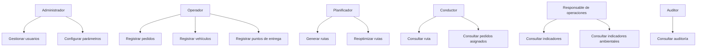

# 08. Usuarios V_1_0_0.md

# Identificación y Perfiles de Usuarios

## 1. Información del documento

| Campo    | Información                 |
| -------- | --------------------------- |
| Proyecto | EcoLogística                |
| Ámbito   | El Tambo, Huancayo y Chilca |
| Versión  | 1.0.0                       |
| Fecha    | 2026-09-03                  |

---

# 2. Matriz de Roles y Actores

| ID    | Perfil                     | Descripción                                        | Interacción |
| ----- | -------------------------- | -------------------------------------------------- | ----------- |
| U-001 | Administrador              | Gestiona usuarios y parámetros                     | Directa     |
| U-002 | Operador logístico         | Registra operaciones y administra datos logísticos | Directa     |
| U-003 | Planificador               | Genera y revisa rutas                              | Directa     |
| U-004 | Conductor                  | Consulta las rutas y pedidos asignados             | Directa     |
| U-005 | Responsable de operaciones | Consulta indicadores y supervisa operaciones       | Directa     |
| U-006 | Auditor                    | Consulta registros de auditoría                    | Directa     |
| U-007 | Usuario de consulta        | Consulta información autorizada                    | Directa     |
| U-008 | Equipo técnico             | Mantiene y evoluciona el sistema                   | Indirecta   |

---

# 3. Historias de Uso Resumidas

## Administrador

**Como administrador**, quiero gestionar usuarios y parámetros del sistema para controlar el acceso y configuración de EcoLogística.

## Operador logístico

**Como operador**, quiero registrar vehículos, pedidos y puntos de entrega para mantener actualizada la información logística.

## Planificador

**Como planificador**, quiero generar y reoptimizar rutas para organizar las entregas considerando las condiciones operativas registradas.

## Conductor

**Como conductor**, quiero consultar mi ruta y los pedidos asignados para conocer las entregas que debo realizar.

## Responsable de operaciones

**Como responsable de operaciones**, quiero consultar indicadores logísticos y ambientales para supervisar los resultados.

## Auditor

**Como auditor**, quiero consultar los registros de auditoría para verificar las operaciones realizadas en el sistema.

## Usuario de consulta

**Como usuario de consulta**, quiero consultar información autorizada para conocer el estado de las operaciones.

---

# 4. Matriz RBAC

| Módulo / Capacidad              | Administrador         | Operador / Técnico     | Usuario Final    | Auditor Externo |
| ------------------------------- | --------------------- | ---------------------- | ---------------- | --------------- |
| Configuración de parámetros     | CRUD                  | Lectura                | Sin acceso       | Lectura         |
| Gestión de usuarios             | CRUD                  | Sin acceso             | Sin acceso       | Lectura         |
| Registro de vehículos           | CRUD                  | CRUD                   | Lectura          | Lectura         |
| Registro de puntos de entrega   | CRUD                  | CRUD                   | Lectura          | Lectura         |
| Registro de pedidos             | CRUD                  | CRUD                   | Crear / Lectura  | Lectura         |
| Generación de rutas             | CRUD                  | CRUD                   | Lectura          | Lectura         |
| Reoptimización de rutas         | CRUD                  | CRUD                   | Sin acceso       | Lectura         |
| Consulta de rutas               | CRUD                  | CRUD                   | Lectura          | Lectura         |
| Actualización de entrega        | CRUD                  | CRUD                   | Crear            | Lectura         |
| Indicadores logísticos          | Lectura               | Lectura                | Lectura limitada | Lectura         |
| Indicadores ambientales         | Lectura               | Lectura                | Lectura limitada | Lectura         |
| Exportación de información      | Lectura / Exportación | Exportación autorizada | Sin acceso       | Lectura         |
| Registros de auditoría          | Lectura               | Sin acceso             | Sin acceso       | Lectura         |
| Depuración / eliminación física | D                     | Sin acceso             | Sin acceso       | Sin acceso      |

---

# 5. Matriz de Acceso por Principio de Mínimo Privilegio

El acceso se asignará considerando únicamente las funciones necesarias para cada perfil.

| Rol                        | Principio aplicado                 |
| -------------------------- | ---------------------------------- |
| Administrador              | Acceso administrativo              |
| Operador                   | Acceso operativo                   |
| Planificador               | Acceso de planificación            |
| Conductor                  | Acceso limitado a rutas asignadas  |
| Responsable de operaciones | Acceso de consulta e indicadores   |
| Auditor                    | Acceso de solo lectura y auditoría |
| Usuario de consulta        | Acceso limitado                    |

---

# 6. Casos de interacción

---

# 7. Revisión de perfiles

Los perfiles deberán revisarse durante las iteraciones del enfoque híbrido. Los cambios deberán registrarse y justificarse antes de modificar los permisos correspondientes.
