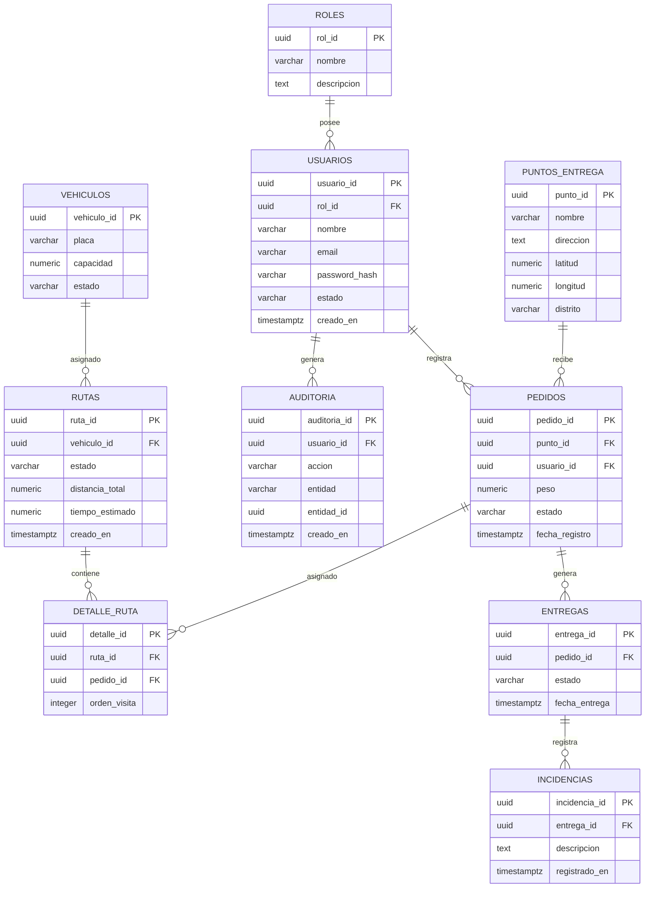

# 11. Base de datos V_1_0_0.md

# Diseño e Ingeniería de Base de Datos

## 1. Información del documento

| Campo         | Información                 |
| ------------- | --------------------------- |
| Proyecto      | EcoLogística                |
| Ámbito        | El Tambo, Huancayo y Chilca |
| Versión       | 1.0.0                       |
| Motor         | PostgreSQL                  |
| Modelo        | Relacional                  |
| Normalización | Tercera Forma Normal (3FN)  |

---

# 2. Modelo Conceptual

Las principales entidades del sistema son:

* Usuario.
* Rol.
* Vehículo.
* Punto de entrega.
* Pedido.
* Ruta.
* Detalle de ruta.
* Entrega.
* Incidencia.
* Registro de auditoría.



---

# 3. Modelo lógico

## Roles

| Campo       | Tipo        | Restricción      |
| ----------- | ----------- | ---------------- |
| rol_id      | UUID        | PK               |
| nombre      | VARCHAR(50) | NOT NULL, UNIQUE |
| descripcion | TEXT        | NULL             |

## Usuarios

| Campo         | Tipo         | Restricción |
| ------------- | ------------ | ----------- |
| usuario_id    | UUID         | PK          |
| rol_id        | UUID         | FK          |
| nombre        | VARCHAR(150) | NOT NULL    |
| email         | VARCHAR(255) | UNIQUE      |
| password_hash | VARCHAR(255) | NOT NULL    |
| estado        | VARCHAR(20)  | NOT NULL    |
| creado_en     | TIMESTAMPTZ  | NOT NULL    |

## Vehículos

| Campo       | Tipo          | Restricción |
| ----------- | ------------- | ----------- |
| vehiculo_id | UUID          | PK          |
| placa       | VARCHAR(20)   | UNIQUE      |
| capacidad   | NUMERIC(10,2) | NOT NULL    |
| estado      | VARCHAR(20)   | NOT NULL    |

## Puntos de entrega

| Campo     | Tipo         | Restricción |
| --------- | ------------ | ----------- |
| punto_id  | UUID         | PK          |
| nombre    | VARCHAR(150) | NOT NULL    |
| direccion | TEXT         | NOT NULL    |
| latitud   | NUMERIC(9,6) | NOT NULL    |
| longitud  | NUMERIC(9,6) | NOT NULL    |
| distrito  | VARCHAR(100) | NOT NULL    |

## Pedidos

| Campo          | Tipo          | Restricción |
| -------------- | ------------- | ----------- |
| pedido_id      | UUID          | PK          |
| punto_id       | UUID          | FK          |
| usuario_id     | UUID          | FK          |
| peso           | NUMERIC(10,2) | NOT NULL    |
| estado         | VARCHAR(30)   | NOT NULL    |
| fecha_registro | TIMESTAMPTZ   | NOT NULL    |

## Rutas

| Campo           | Tipo          | Restricción |
| --------------- | ------------- | ----------- |
| ruta_id         | UUID          | PK          |
| vehiculo_id     | UUID          | FK          |
| estado          | VARCHAR(30)   | NOT NULL    |
| distancia_total | NUMERIC(12,2) | NULL        |
| tiempo_estimado | NUMERIC(12,2) | NULL        |
| creado_en       | TIMESTAMPTZ   | NOT NULL    |

## Detalle de ruta

| Campo        | Tipo    | Restricción |
| ------------ | ------- | ----------- |
| detalle_id   | UUID    | PK          |
| ruta_id      | UUID    | FK          |
| pedido_id    | UUID    | FK          |
| orden_visita | INTEGER | NOT NULL    |

## Entregas

| Campo         | Tipo        | Restricción |
| ------------- | ----------- | ----------- |
| entrega_id    | UUID        | PK          |
| pedido_id     | UUID        | FK          |
| estado        | VARCHAR(30) | NOT NULL    |
| fecha_entrega | TIMESTAMPTZ | NULL        |

## Incidencias

| Campo         | Tipo        | Restricción |
| ------------- | ----------- | ----------- |
| incidencia_id | UUID        | PK          |
| entrega_id    | UUID        | FK          |
| descripcion   | TEXT        | NOT NULL    |
| registrado_en | TIMESTAMPTZ | NOT NULL    |

## Auditoría

| Campo        | Tipo         | Restricción |
| ------------ | ------------ | ----------- |
| auditoria_id | UUID         | PK          |
| usuario_id   | UUID         | FK          |
| accion       | VARCHAR(100) | NOT NULL    |
| entidad      | VARCHAR(100) | NOT NULL    |
| entidad_id   | UUID         | NULL        |
| creado_en    | TIMESTAMPTZ  | NOT NULL    |

---

# 4. Normalización

El modelo se plantea en **Tercera Forma Normal (3FN)**.

### Primera Forma Normal

Los atributos contienen valores atómicos y no existen grupos repetitivos dentro de las entidades.

### Segunda Forma Normal

Los atributos no clave dependen de la totalidad de la clave primaria.

### Tercera Forma Normal

Los atributos no clave dependen únicamente de la clave primaria y no de otros atributos no clave.

---

# 5. Modelo físico

```sql
CREATE EXTENSION IF NOT EXISTS pgcrypto;

CREATE TABLE roles (
    rol_id UUID PRIMARY KEY DEFAULT gen_random_uuid(),
    nombre VARCHAR(50) NOT NULL UNIQUE,
    descripcion TEXT
);

CREATE TABLE usuarios (
    usuario_id UUID PRIMARY KEY DEFAULT gen_random_uuid(),
    rol_id UUID NOT NULL REFERENCES roles(rol_id),
    nombre VARCHAR(150) NOT NULL,
    email VARCHAR(255) NOT NULL UNIQUE,
    password_hash VARCHAR(255) NOT NULL,
    estado VARCHAR(20) NOT NULL DEFAULT 'ACTIVO',
    creado_en TIMESTAMPTZ NOT NULL DEFAULT CURRENT_TIMESTAMP
);

CREATE TABLE vehiculos (
    vehiculo_id UUID PRIMARY KEY DEFAULT gen_random_uuid(),
    placa VARCHAR(20) NOT NULL UNIQUE,
    capacidad NUMERIC(10,2) NOT NULL CHECK (capacidad > 0),
    estado VARCHAR(20) NOT NULL DEFAULT 'DISPONIBLE'
);

CREATE TABLE puntos_entrega (
    punto_id UUID PRIMARY KEY DEFAULT gen_random_uuid(),
    nombre VARCHAR(150) NOT NULL,
    direccion TEXT NOT NULL,
    latitud NUMERIC(9,6) NOT NULL,
    longitud NUMERIC(9,6) NOT NULL,
    distrito VARCHAR(100) NOT NULL
);

CREATE TABLE pedidos (
    pedido_id UUID PRIMARY KEY DEFAULT gen_random_uuid(),
    punto_id UUID NOT NULL REFERENCES puntos_entrega(punto_id),
    usuario_id UUID NOT NULL REFERENCES usuarios(usuario_id),
    peso NUMERIC(10,2) NOT NULL CHECK (peso > 0),
    estado VARCHAR(30) NOT NULL DEFAULT 'PENDIENTE',
    fecha_registro TIMESTAMPTZ NOT NULL DEFAULT CURRENT_TIMESTAMP
);

CREATE TABLE rutas (
    ruta_id UUID PRIMARY KEY DEFAULT gen_random_uuid(),
    vehiculo_id UUID NOT NULL REFERENCES vehiculos(vehiculo_id),
    estado VARCHAR(30) NOT NULL DEFAULT 'PROPUESTA',
    distancia_total NUMERIC(12,2),
    tiempo_estimado NUMERIC(12,2),
    creado_en TIMESTAMPTZ NOT NULL DEFAULT CURRENT_TIMESTAMP
);

CREATE TABLE detalle_ruta (
    detalle_id UUID PRIMARY KEY DEFAULT gen_random_uuid(),
    ruta_id UUID NOT NULL REFERENCES rutas(ruta_id),
    pedido_id UUID NOT NULL REFERENCES pedidos(pedido_id),
    orden_visita INTEGER NOT NULL CHECK (orden_visita > 0),
    UNIQUE (ruta_id, pedido_id),
    UNIQUE (ruta_id, orden_visita)
);

CREATE TABLE entregas (
    entrega_id UUID PRIMARY KEY DEFAULT gen_random_uuid(),
    pedido_id UUID NOT NULL REFERENCES pedidos(pedido_id),
    estado VARCHAR(30) NOT NULL,
    fecha_entrega TIMESTAMPTZ
);

CREATE TABLE incidencias (
    incidencia_id UUID PRIMARY KEY DEFAULT gen_random_uuid(),
    entrega_id UUID NOT NULL REFERENCES entregas(entrega_id),
    descripcion TEXT NOT NULL,
    registrado_en TIMESTAMPTZ NOT NULL DEFAULT CURRENT_TIMESTAMP
);

CREATE TABLE auditoria (
    auditoria_id UUID PRIMARY KEY DEFAULT gen_random_uuid(),
    usuario_id UUID REFERENCES usuarios(usuario_id),
    accion VARCHAR(100) NOT NULL,
    entidad VARCHAR(100) NOT NULL,
    entidad_id UUID,
    creado_en TIMESTAMPTZ NOT NULL DEFAULT CURRENT_TIMESTAMP
);
```

---

# 6. Índices

```sql
CREATE INDEX idx_usuarios_email
ON usuarios(email);

CREATE INDEX idx_pedidos_estado
ON pedidos(estado);

CREATE INDEX idx_pedidos_punto
ON pedidos(punto_id);

CREATE INDEX idx_rutas_vehiculo
ON rutas(vehiculo_id);

CREATE INDEX idx_detalle_ruta_ruta
ON detalle_ruta(ruta_id);

CREATE INDEX idx_detalle_ruta_pedido
ON detalle_ruta(pedido_id);

CREATE INDEX idx_entregas_pedido
ON entregas(pedido_id);

CREATE INDEX idx_auditoria_usuario
ON auditoria(usuario_id);

CREATE INDEX idx_auditoria_fecha
ON auditoria(creado_en);
```

---

# 7. Integridad

El modelo utiliza:

* Claves primarias.
* Claves foráneas.
* Restricciones `NOT NULL`.
* Restricciones `UNIQUE`.
* Restricciones `CHECK`.
* Índices para consultas frecuentes.
* Relaciones normalizadas.
