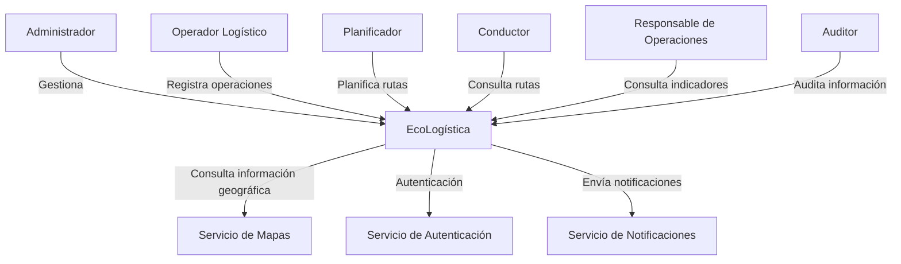
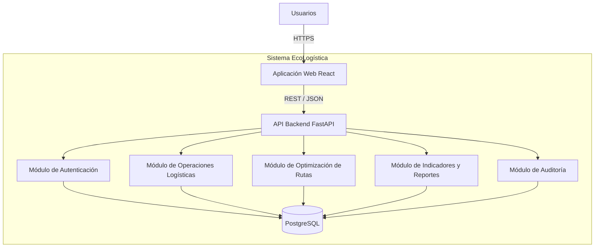
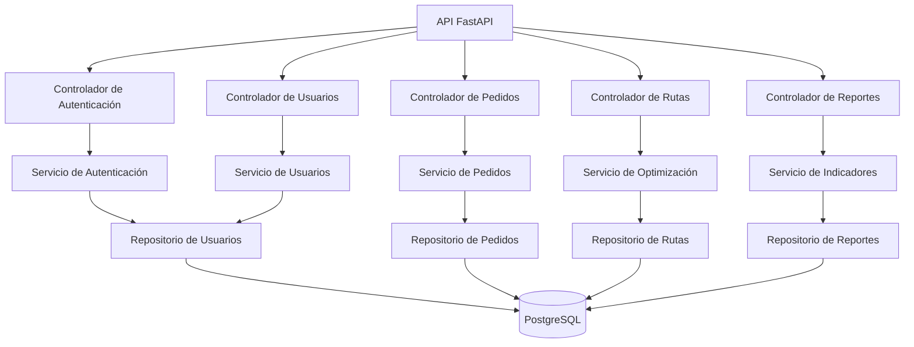

# 12. Modelo C4 V_1_0_0.md

# Arquitectura de Software - Modelo C4

## 1. Información del documento

| Campo        | Información                 |
| ------------ | --------------------------- |
| Proyecto     | EcoLogística                |
| Ámbito       | El Tambo, Huancayo y Chilca |
| Versión      | 1.0.0                       |
| Arquitectura | Aplicación web              |
| Modelo       | C4                          |
| Fecha        | 2026-09-03                  |

---

# 2. Descripción arquitectónica

EcoLogística se plantea como una aplicación web organizada en capas y componentes.

La arquitectura está compuesta principalmente por:

* Interfaz web.
* API backend.
* Módulos de negocio.
* Base de datos relacional.
* Servicios externos cuando sean necesarios.

---

# 3. Nivel 1 - Diagrama de Contexto



---

# 4. Nivel 2 - Diagrama de Contenedores



---

# 5. Descripción de contenedores

## Aplicación Web React

Responsable de presentar la información y permitir la interacción de los usuarios con EcoLogística.

Funciones:

* Inicio de sesión.
* Gestión de información.
* Consulta de pedidos.
* Visualización de rutas.
* Indicadores.
* Reportes.

## API Backend FastAPI

Responsable de:

* Recibir solicitudes.
* Validar información.
* Aplicar reglas de negocio.
* Coordinar los módulos.
* Consultar y modificar datos.

## Módulo de Autenticación

Gestiona:

* Inicio de sesión.
* Validación de credenciales.
* Roles.
* Permisos.
* Sesiones.

## Módulo de Operaciones Logísticas

Gestiona:

* Vehículos.
* Pedidos.
* Puntos de entrega.
* Entregas.

## Módulo de Optimización

Gestiona:

* Generación de rutas.
* Asignación de pedidos.
* Reoptimización.
* Restricciones de capacidad.

## Módulo de Indicadores

Gestiona:

* Indicadores logísticos.
* Indicadores ambientales.
* Reportes.

## Módulo de Auditoría

Gestiona:

* Registro de acciones.
* Consulta de eventos.
* Trazabilidad.

## PostgreSQL

Responsable de almacenar la información persistente.

---

# 6. Nivel 3 - Diagrama de Componentes



---

# 7. Capas de la API

```text
Presentación
    ↓
Controladores
    ↓
Servicios de negocio
    ↓
Repositorios
    ↓
PostgreSQL
```

### Presentación

Recibe las solicitudes provenientes de la aplicación web.

### Controladores

Gestionan endpoints y validaciones iniciales.

### Servicios

Contienen la lógica de negocio.

### Repositorios

Gestionan el acceso a la base de datos.

### Persistencia

PostgreSQL almacena la información.

---

# 8. Principios arquitectónicos

La arquitectura considera:

1. Separación de responsabilidades.
2. Bajo acoplamiento entre módulos.
3. Alta cohesión.
4. Seguridad por roles.
5. Persistencia relacional.
6. Trazabilidad.
7. Escalabilidad progresiva.
8. Mantenibilidad.
9. Optimización del consumo de recursos.
10. Evolución iterativa mediante el enfoque híbrido.

---

# 9. Seguridad

El sistema deberá aplicar:

* Autenticación.
* Autorización por roles.
* Validación de entradas.
* Protección de credenciales.
* Registro de auditoría.
* Comunicación mediante HTTPS.
* Restricción de acceso a información según permisos.

---

# 10. Integración con servicios externos

Los servicios externos podrán incluir:

* Servicios de mapas.
* Servicios de geocodificación.
* Servicios de notificación.

La incorporación de cada servicio deberá ser evaluada según costo, disponibilidad, privacidad y dependencia tecnológica.

---

# 11. Evolución arquitectónica

La arquitectura inicial se considera una línea base para el MVP.

Debido al enfoque híbrido, las decisiones podrán evolucionar durante las iteraciones cuando exista evidencia técnica u operativa que justifique modificaciones.
