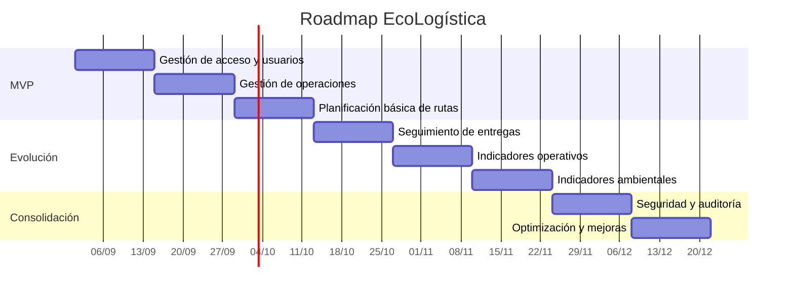

# Transformando a ágil

[← Volver al README Principal](../../README.md)

## 1. Información general

| Campo                  | Información                     |
| ---------------------- | ------------------------------- |
| Proyecto               | EcoLogística                    |
| Fase                   | 02 - Planificación del Proyecto |
| Enfoque                | Híbrido                         |
| Ámbito geográfico      | El Tambo, Huancayo y Chilca     |
| Versión                | V_1_0_0                         |
| Metodología de gestión | Scrum                           |
| Release inicial        | v1.0.0-MVP                      |
| Sprint inicial         | Sprint 1                        |
| Duración del Sprint    | 2 semanas                       |

## 2. Introducción

El proyecto EcoLogística adopta un enfoque híbrido de gestión, combinando elementos de planificación tradicional con prácticas ágiles. La definición inicial del alcance, requisitos y restricciones se mantiene como referencia para controlar el proyecto, mientras que la construcción y entrega de funcionalidades se organiza mediante un backlog priorizado y ciclos iterativos utilizando Scrum.

La transformación de los requisitos tradicionales hacia un backlog ágil permite convertir las necesidades identificadas durante la fase de inicio en Épicas, Historias de Usuario, Enablers y tareas técnicas. De esta manera, el equipo puede priorizar el trabajo considerando tanto el valor para el negocio como el riesgo técnico.

El sistema estará orientado a apoyar la gestión logística y la toma de decisiones relacionadas con operaciones de distribución en El Tambo, Huancayo y Chilca.

---

# 3. Transformación de requisitos a backlog ágil

## 3.1 Jerarquía utilizada

La estructura del backlog será:

```text
Épica
│
├── Historia de Usuario
│   ├── Sub-tarea
│   └── Sub-tarea
│
└── Historia de Usuario
    └── Sub-tarea

Épica
│
├── Enabler técnico
│   ├── Tarea técnica
│   └── Sub-tarea
```

### Criterios de la jerarquía

| Elemento            | Descripción                                                                     |
| ------------------- | ------------------------------------------------------------------------------- |
| Épica               | Representa un bloque funcional importante del sistema.                          |
| Historia de Usuario | Representa una funcionalidad que entrega valor a un usuario.                    |
| Enabler             | Trabajo técnico necesario para habilitar, mantener o mejorar una funcionalidad. |
| Task                | Trabajo técnico o administrativo concreto.                                      |
| Sub-task            | Actividad específica asociada a una Story o Task. No debe superar 8 horas.      |
| Bug                 | Incidente o defecto encontrado durante el desarrollo o pruebas.                 |

---

# 4. Mapeo de requisitos funcionales

Los requisitos funcionales identificados en la fase de inicio se transforman en las siguientes Épicas e Historias de Usuario.

| Requisito funcional | Épica                                       | Historias relacionadas |
| ------------------- | ------------------------------------------- | ---------------------- |
| RF-001              | EP-01 Gestión de acceso y usuarios          | US-001                 |
| RF-002              | EP-01 Gestión de acceso y usuarios          | US-002                 |
| RF-003              | EP-02 Gestión de operaciones logísticas     | US-003                 |
| RF-004              | EP-02 Gestión de operaciones logísticas     | US-004                 |
| RF-005              | EP-02 Gestión de operaciones logísticas     | US-005                 |
| RF-006              | EP-03 Planificación y optimización de rutas | US-006                 |
| RF-007              | EP-04 Seguimiento y entregas                | US-010                 |
| RF-008              | EP-03 Planificación y optimización de rutas | US-007, US-008         |
| RF-009              | EP-04 Seguimiento y entregas                | US-009                 |
| RF-010              | EP-04 Seguimiento y entregas                | US-010                 |
| RF-011              | EP-05 Indicadores y sostenibilidad          | US-011                 |
| RF-012              | EP-05 Indicadores y sostenibilidad          | US-012                 |
| RF-013              | EP-06 Seguridad, auditoría y plataforma     | US-013                 |
| RF-014              | EP-06 Seguridad, auditoría y plataforma     | US-014                 |
| RF-015              | EP-06 Seguridad, auditoría y plataforma     | US-015                 |

---

# 5. Épicas

## EP-01 - Gestión de acceso y usuarios

Permite administrar el acceso al sistema y los usuarios de EcoLogística según sus responsabilidades dentro de la operación.

## EP-02 - Gestión de operaciones logísticas

Permite registrar y administrar los principales elementos necesarios para realizar las operaciones logísticas, como vehículos, puntos de entrega y pedidos.

## EP-03 - Planificación y optimización de rutas

Permite generar, visualizar y mejorar rutas de distribución considerando la información registrada en el sistema.

## EP-04 - Seguimiento y entregas

Permite consultar pedidos y registrar el resultado de las entregas realizadas.

## EP-05 - Indicadores y sostenibilidad

Permite consultar indicadores operativos y ambientales para apoyar la toma de decisiones.

## EP-06 - Seguridad, auditoría y plataforma

Agrupa funcionalidades relacionadas con exportación, auditoría, configuración y aspectos técnicos necesarios para la operación segura del sistema.

---

# 6. Historias de Usuario

## US-001 - Iniciar sesión

**ID:** US-001
**Título:** Iniciar sesión
**Épica Relacionada:** EP-01 Gestión de acceso y usuarios
**Story Points:** 3
**Prioridad:** Alta

### Redacción

**Como** usuario registrado,
**quiero** iniciar sesión utilizando mis credenciales,
**para** acceder de manera segura a las funcionalidades correspondientes a mi rol.

### Criterios de aceptación

```gherkin
Escenario: Inicio de sesión exitoso
Dado que el usuario tiene una cuenta registrada
Cuando ingresa credenciales válidas
Entonces el sistema debe permitirle acceder al sistema.
```

```gherkin
Escenario: Credenciales incorrectas
Dado que el usuario se encuentra en el formulario de inicio de sesión
Cuando ingresa credenciales incorrectas
Entonces el sistema debe mostrar un mensaje de error y no permitir el acceso.
```

---

## US-002 - Gestionar usuarios

**ID:** US-002
**Título:** Gestionar usuarios
**Épica Relacionada:** EP-01 Gestión de acceso y usuarios
**Story Points:** 5
**Prioridad:** Alta

### Redacción

**Como** administrador,
**quiero** registrar, consultar y actualizar usuarios,
**para** controlar el acceso de las personas que utilizan el sistema.

### Criterios de aceptación

```gherkin
Escenario: Registrar usuario
Dado que el administrador tiene acceso a la gestión de usuarios
Cuando registra los datos obligatorios de un nuevo usuario
Entonces el sistema debe guardar el usuario correctamente.
```

```gherkin
Escenario: Actualizar usuario
Dado que existe un usuario registrado
Cuando el administrador modifica sus datos permitidos
Entonces el sistema debe actualizar la información correctamente.
```

---

## US-003 - Registrar vehículos

**ID:** US-003
**Título:** Registrar vehículos
**Épica Relacionada:** EP-02 Gestión de operaciones logísticas
**Story Points:** 3
**Prioridad:** Alta

### Redacción

**Como** responsable logístico,
**quiero** registrar los vehículos disponibles,
**para** contar con información actualizada para la planificación de las operaciones.

### Criterios de aceptación

```gherkin
Escenario: Registrar vehículo correctamente
Dado que el responsable logístico accede al módulo de vehículos
Cuando registra todos los datos obligatorios del vehículo
Entonces el sistema debe guardar el vehículo.
```

```gherkin
Escenario: Datos obligatorios incompletos
Dado que el responsable está registrando un vehículo
Cuando omite un dato obligatorio
Entonces el sistema debe informar el campo faltante y evitar el registro.
```

---

## US-004 - Registrar puntos de entrega

**ID:** US-004
**Título:** Registrar puntos de entrega
**Épica Relacionada:** EP-02 Gestión de operaciones logísticas
**Story Points:** 5
**Prioridad:** Alta

### Redacción

**Como** responsable logístico,
**quiero** registrar los puntos de entrega,
**para** disponer de ubicaciones organizadas para la planificación de rutas.

### Criterios de aceptación

```gherkin
Escenario: Registrar punto de entrega
Dado que el responsable se encuentra en el módulo de puntos de entrega
Cuando ingresa la información requerida
Entonces el sistema debe registrar el punto de entrega.
```

```gherkin
Escenario: Consultar punto registrado
Dado que existe un punto de entrega registrado
Cuando el usuario realiza una consulta
Entonces el sistema debe mostrar la información correspondiente.
```

---

## US-005 - Registrar pedidos

**ID:** US-005
**Título:** Registrar pedidos
**Épica Relacionada:** EP-02 Gestión de operaciones logísticas
**Story Points:** 5
**Prioridad:** Alta

### Redacción

**Como** responsable de operaciones,
**quiero** registrar pedidos de distribución,
**para** organizar las entregas que deben ser atendidas.

### Criterios de aceptación

```gherkin
Escenario: Registrar pedido
Dado que existe un punto de entrega válido
Cuando el responsable registra los datos requeridos del pedido
Entonces el sistema debe guardar el pedido correctamente.
```

```gherkin
Escenario: Pedido con información inválida
Dado que el responsable está registrando un pedido
Cuando ingresa información inválida
Entonces el sistema debe mostrar un mensaje indicando el error y no guardar el pedido.
```

---

## US-006 - Generar rutas

**ID:** US-006
**Título:** Generar rutas de distribución
**Épica Relacionada:** EP-03 Planificación y optimización de rutas
**Story Points:** 13
**Prioridad:** Muy Alta

### Redacción

**Como** planificador logístico,
**quiero** generar rutas de distribución a partir de pedidos y puntos de entrega,
**para** organizar recorridos eficientes para las operaciones logísticas.

### Criterios de aceptación

```gherkin
Escenario: Generar ruta con información válida
Dado que existen pedidos y puntos de entrega disponibles
Cuando el planificador solicita generar una ruta
Entonces el sistema debe generar una propuesta de ruta.
```

```gherkin
Escenario: No existen pedidos disponibles
Dado que el sistema no tiene pedidos pendientes
Cuando el planificador solicita generar una ruta
Entonces el sistema debe informar que no existen pedidos disponibles.
```

---

## US-007 - Visualizar rutas

**ID:** US-007
**Título:** Visualizar rutas
**Épica Relacionada:** EP-03 Planificación y optimización de rutas
**Story Points:** 5
**Prioridad:** Alta

### Redacción

**Como** planificador logístico,
**quiero** visualizar las rutas generadas,
**para** revisar el recorrido antes de ejecutar las entregas.

### Criterios de aceptación

```gherkin
Escenario: Visualizar ruta generada
Dado que existe una ruta generada
Cuando el usuario selecciona la ruta
Entonces el sistema debe mostrar sus puntos y recorrido.
```

```gherkin
Escenario: Consultar ruta inexistente
Dado que no existe una ruta seleccionada
Cuando el usuario intenta visualizarla
Entonces el sistema debe mostrar un mensaje informativo.
```

---

## US-008 - Reoptimizar rutas

**ID:** US-008
**Título:** Reoptimizar rutas
**Épica Relacionada:** EP-03 Planificación y optimización de rutas
**Story Points:** 13
**Prioridad:** Alta

### Redacción

**Como** planificador logístico,
**quiero** reoptimizar una ruta cuando cambien las condiciones de operación,
**para** reducir recorridos innecesarios y mejorar la eficiencia logística.

### Criterios de aceptación

```gherkin
Escenario: Reoptimizar una ruta existente
Dado que existe una ruta previamente generada
Cuando el usuario solicita su reoptimización
Entonces el sistema debe generar una nueva propuesta de recorrido.
```

```gherkin
Escenario: Reoptimización sin ruta
Dado que no existe una ruta disponible
Cuando el usuario solicita reoptimizar
Entonces el sistema debe informar que no existe una ruta para procesar.
```

---

## US-009 - Consultar pedidos

**ID:** US-009
**Título:** Consultar pedidos
**Épica Relacionada:** EP-04 Seguimiento y entregas
**Story Points:** 3
**Prioridad:** Alta

### Redacción

**Como** usuario operativo,
**quiero** consultar los pedidos registrados,
**para** conocer su estado y la información asociada a cada entrega.

### Criterios de aceptación

```gherkin
Escenario: Consultar pedidos
Dado que existen pedidos registrados
Cuando el usuario accede al módulo de pedidos
Entonces el sistema debe mostrar los pedidos disponibles.
```

```gherkin
Escenario: Filtrar pedidos
Dado que existen varios pedidos registrados
Cuando el usuario aplica un filtro válido
Entonces el sistema debe mostrar únicamente los pedidos correspondientes al filtro.
```

---

## US-010 - Registrar entregas

**ID:** US-010
**Título:** Registrar entregas
**Épica Relacionada:** EP-04 Seguimiento y entregas
**Story Points:** 5
**Prioridad:** Alta

### Redacción

**Como** responsable de entrega,
**quiero** registrar el resultado de una entrega,
**para** mantener actualizado el estado de los pedidos.

### Criterios de aceptación

```gherkin
Escenario: Registrar entrega exitosa
Dado que existe un pedido pendiente
Cuando el responsable registra que el pedido fue entregado
Entonces el sistema debe actualizar su estado.
```

```gherkin
Escenario: Registrar entrega no completada
Dado que existe un pedido pendiente
Cuando el responsable registra que la entrega no fue completada
Entonces el sistema debe conservar el historial y actualizar el estado correspondiente.
```

---

## US-011 - Consultar indicadores

**ID:** US-011
**Título:** Consultar indicadores operativos
**Épica Relacionada:** EP-05 Indicadores y sostenibilidad
**Story Points:** 5
**Prioridad:** Media

### Redacción

**Como** responsable logístico,
**quiero** consultar indicadores operativos,
**para** evaluar el desempeño de las operaciones de distribución.

### Criterios de aceptación

```gherkin
Escenario: Visualizar indicadores
Dado que existen datos operativos registrados
Cuando el usuario accede al módulo de indicadores
Entonces el sistema debe mostrar los indicadores disponibles.
```

```gherkin
Escenario: Sin datos suficientes
Dado que no existen datos para calcular un indicador
Cuando el usuario consulta los indicadores
Entonces el sistema debe mostrar un mensaje indicando la falta de información.
```

---

## US-012 - Consultar indicadores ambientales

**ID:** US-012
**Título:** Consultar indicadores ambientales
**Épica Relacionada:** EP-05 Indicadores y sostenibilidad
**Story Points:** 5
**Prioridad:** Media

### Redacción

**Como** responsable de sostenibilidad,
**quiero** consultar indicadores ambientales relacionados con la operación logística,
**para** evaluar oportunidades de reducción del impacto ambiental.

### Criterios de aceptación

```gherkin
Escenario: Consultar indicadores ambientales
Dado que existen datos necesarios para el cálculo
Cuando el usuario consulta los indicadores ambientales
Entonces el sistema debe mostrar los valores calculados.
```

```gherkin
Escenario: Datos insuficientes
Dado que no existen datos suficientes
Cuando el usuario solicita los indicadores
Entonces el sistema debe informar que no es posible realizar el cálculo.
```

---

## US-013 - Exportar información

**ID:** US-013
**Título:** Exportar información
**Épica Relacionada:** EP-06 Seguridad, auditoría y plataforma
**Story Points:** 3
**Prioridad:** Media

### Redacción

**Como** usuario autorizado,
**quiero** exportar información del sistema,
**para** utilizar los datos en reportes y análisis externos.

### Criterios de aceptación

```gherkin
Escenario: Exportar información
Dado que el usuario tiene permisos de exportación
Cuando solicita exportar la información
Entonces el sistema debe generar el archivo correspondiente.
```

```gherkin
Escenario: Usuario sin permisos
Dado que el usuario no tiene permisos de exportación
Cuando intenta exportar información
Entonces el sistema debe impedir la operación.
```

---

## US-014 - Consultar auditoría

**ID:** US-014
**Título:** Consultar auditoría
**Épica Relacionada:** EP-06 Seguridad, auditoría y plataforma
**Story Points:** 3
**Prioridad:** Media

### Redacción

**Como** administrador,
**quiero** consultar las acciones registradas en el sistema,
**para** realizar seguimiento de las operaciones y mantener trazabilidad.

### Criterios de aceptación

```gherkin
Escenario: Consultar registros de auditoría
Dado que existen acciones registradas
Cuando el administrador accede al módulo de auditoría
Entonces el sistema debe mostrar los registros disponibles.
```

```gherkin
Escenario: Filtrar auditoría
Dado que existen múltiples registros
Cuando el administrador aplica un filtro
Entonces el sistema debe mostrar los registros que coincidan con el criterio seleccionado.
```

---

## US-015 - Configurar parámetros

**ID:** US-015
**Título:** Configurar parámetros del sistema
**Épica Relacionada:** EP-06 Seguridad, auditoría y plataforma
**Story Points:** 5
**Prioridad:** Baja

### Redacción

**Como** administrador,
**quiero** configurar parámetros permitidos del sistema,
**para** adaptar su funcionamiento a las necesidades de la operación.

### Criterios de aceptación

```gherkin
Escenario: Actualizar parámetro
Dado que el administrador tiene permisos de configuración
Cuando modifica un parámetro válido
Entonces el sistema debe guardar la nueva configuración.
```

```gherkin
Escenario: Usuario sin permisos
Dado que el usuario no posee permisos administrativos
Cuando intenta modificar un parámetro
Entonces el sistema debe impedir la modificación.
```

---

# 7. Transformación de requisitos no funcionales

Los requisitos no funcionales se transforman principalmente en Enablers técnicos y criterios transversales de calidad.

| RNF     | Enabler | Descripción               |
| ------- | ------- | ------------------------- |
| RNF-001 | EN-001  | Rendimiento de consultas  |
| RNF-002 | EN-002  | Seguridad y autorización  |
| RNF-003 | EN-003  | Disponibilidad            |
| RNF-004 | EN-004  | Integridad de datos       |
| RNF-005 | EN-005  | Pruebas de usabilidad     |
| RNF-006 | EN-006  | Compatibilidad web        |
| RNF-007 | EN-007  | Mantenibilidad            |
| RNF-008 | EN-008  | Pruebas de carga          |
| RNF-009 | EN-009  | Recuperación              |
| RNF-010 | EN-010  | Auditoría                 |
| RNF-011 | EN-011  | Protección de información |
| RNF-012 | EN-012  | Optimización del consumo  |

---

# 8. Enablers técnicos

## EN-001 - Rendimiento de consultas

**ID:** EN-001
**Título:** Optimizar rendimiento de consultas
**Tipo:** Enabler

### Descripción

Implementar mecanismos de optimización para garantizar tiempos de respuesta adecuados en las consultas principales del sistema.

### Criterios de aceptación

```gherkin
Escenario: Consulta optimizada
Dado que existen registros en la base de datos
Cuando el usuario realiza una consulta frecuente
Entonces el sistema debe responder dentro del tiempo objetivo definido para la aplicación.
```

```gherkin
Escenario: Consulta con múltiples registros
Dado que existe un volumen considerable de información
Cuando el usuario realiza una consulta
Entonces el sistema debe mantener un comportamiento estable sin errores críticos.
```

---

## EN-002 - Seguridad y autorización

**ID:** EN-002
**Título:** Implementar seguridad y autorización
**Tipo:** Enabler

### Criterios de aceptación

```gherkin
Escenario: Acceso autorizado
Dado que el usuario tiene credenciales válidas y permisos suficientes
Cuando intenta acceder a una funcionalidad
Entonces el sistema debe permitir la operación.
```

```gherkin
Escenario: Acceso no autorizado
Dado que el usuario no posee permisos suficientes
Cuando intenta acceder a una funcionalidad restringida
Entonces el sistema debe rechazar la operación.
```

---

## EN-003 - Disponibilidad

**ID:** EN-003
**Título:** Garantizar disponibilidad del sistema
**Tipo:** Enabler

### Criterios de aceptación

```gherkin
Escenario: Acceso al sistema
Dado que la infraestructura se encuentra operativa
Cuando el usuario intenta acceder
Entonces el sistema debe estar disponible.
```

```gherkin
Escenario: Fallo de servicio
Dado que ocurre una interrupción temporal
Cuando el sistema detecta el problema
Entonces debe mostrar un mensaje controlado y registrar el incidente.
```

---

## EN-004 - Integridad de datos

**ID:** EN-004
**Título:** Garantizar integridad de información
**Tipo:** Enabler

### Criterios de aceptación

```gherkin
Escenario: Guardado válido
Dado que el usuario ingresa información válida
Cuando confirma el registro
Entonces los datos deben almacenarse correctamente.
```

```gherkin
Escenario: Operación inválida
Dado que una operación no cumple las reglas de validación
Cuando el usuario intenta guardarla
Entonces el sistema debe rechazarla sin almacenar información inconsistente.
```

---

## EN-005 - Pruebas de usabilidad

**ID:** EN-005
**Título:** Validar usabilidad
**Tipo:** Enabler

### Criterios de aceptación

```gherkin
Escenario: Navegación del sistema
Dado que un usuario accede al sistema
Cuando navega por los módulos principales
Entonces debe poder identificar las opciones disponibles.
```

```gherkin
Escenario: Formulario
Dado que el usuario completa un formulario
Cuando ingresa información inválida
Entonces el sistema debe mostrar mensajes claros para corregirla.
```

---

## EN-006 - Compatibilidad web

**ID:** EN-006
**Título:** Garantizar compatibilidad web
**Tipo:** Enabler

### Criterios de aceptación

```gherkin
Escenario: Acceso desde navegador compatible
Dado que el usuario utiliza un navegador web soportado
Cuando accede al sistema
Entonces la interfaz debe funcionar correctamente.
```

```gherkin
Escenario: Visualización responsive
Dado que el usuario accede desde una pantalla diferente
Cuando utiliza el sistema
Entonces los componentes principales deben mantenerse utilizables.
```

---

## EN-007 - Mantenibilidad

**ID:** EN-007
**Título:** Mejorar mantenibilidad del código
**Tipo:** Enabler

### Criterios de aceptación

```gherkin
Escenario: Revisión de código
Dado que existe una nueva implementación
Cuando se realiza la revisión técnica
Entonces el código debe cumplir las convenciones definidas por el proyecto.
```

```gherkin
Escenario: Documentación técnica
Dado que se incorpora una funcionalidad
Cuando finaliza su implementación
Entonces la documentación técnica relacionada debe estar actualizada.
```

---

## EN-008 - Pruebas de carga

**ID:** EN-008
**Título:** Ejecutar pruebas de carga
**Tipo:** Enabler

### Criterios de aceptación

```gherkin
Escenario: Ejecución de prueba de carga
Dado que existe una versión desplegada para pruebas
Cuando se ejecuta una prueba de carga
Entonces el sistema debe registrar las métricas obtenidas.
```

```gherkin
Escenario: Detección de degradación
Dado que una prueba supera la carga objetivo
Cuando se detecta una degradación significativa
Entonces el equipo debe registrar el incidente para su análisis.
```

---

## EN-009 - Recuperación

**ID:** EN-009
**Título:** Implementar mecanismos de recuperación
**Tipo:** Enabler

### Criterios de aceptación

```gherkin
Escenario: Recuperación de información
Dado que existe un respaldo válido
Cuando ocurre una pérdida controlada de información
Entonces debe ser posible recuperar los datos desde el respaldo.
```

```gherkin
Escenario: Validación del respaldo
Dado que se genera un respaldo
Cuando se verifica su integridad
Entonces el respaldo debe poder ser utilizado para recuperación.
```

---

## EN-010 - Auditoría

**ID:** EN-010
**Título:** Implementar trazabilidad de operaciones
**Tipo:** Enabler

### Criterios de aceptación

```gherkin
Escenario: Registro de operación
Dado que un usuario realiza una operación relevante
Cuando la operación finaliza
Entonces el sistema debe registrar la acción correspondiente.
```

```gherkin
Escenario: Consulta de trazabilidad
Dado que existen acciones registradas
Cuando un administrador consulta la auditoría
Entonces debe poder identificar la operación registrada.
```

---

## EN-011 - Protección de información

**ID:** EN-011
**Título:** Proteger información sensible
**Tipo:** Enabler

### Criterios de aceptación

```gherkin
Escenario: Protección de credenciales
Dado que se almacena información de autenticación
Cuando el sistema guarda los datos
Entonces las credenciales no deben almacenarse en texto plano.
```

```gherkin
Escenario: Acceso restringido
Dado que existe información protegida
Cuando un usuario no autorizado intenta consultarla
Entonces el sistema debe impedir el acceso.
```

---

## EN-012 - Optimización del consumo

**ID:** EN-012
**Título:** Optimizar consumo de recursos
**Tipo:** Enabler

### Criterios de aceptación

```gherkin
Escenario: Uso eficiente de recursos
Dado que el sistema ejecuta una operación logística
Cuando procesa la información
Entonces debe evitar procesos innecesarios que incrementen el consumo de recursos.
```

```gherkin
Escenario: Generación de información ambiental
Dado que existen datos suficientes
Cuando el sistema procesa indicadores ambientales
Entonces debe calcularlos utilizando los parámetros establecidos.
```

---

# 9. Definition of Done - DoD

Una Historia de Usuario, Enabler o Task será considerada terminada cuando cumpla como mínimo los siguientes criterios:

1. La funcionalidad solicitada se encuentra implementada.
2. Los criterios de aceptación definidos en Gherkin fueron satisfechos.
3. Se realizaron pruebas unitarias correspondientes.
4. La cobertura de pruebas unitarias debe ser igual o superior al **80 %**.
5. Se realizó análisis estático del código mediante SonarQube, CodeQL o herramienta equivalente.
6. No existen vulnerabilidades críticas pendientes.
7. Existe un Pull Request asociado al cambio.
8. El Pull Request fue aprobado mediante revisión por al menos un compañero técnico.
9. La solución fue integrada correctamente al repositorio.
10. El despliegue automatizado puede ejecutarse en el ambiente de **Staging/Test**.
11. La documentación del código y de la API se encuentra actualizada.
12. La documentación de API mediante **OpenAPI/Swagger** se encuentra actualizada cuando corresponda.
13. No existen defectos críticos o bloqueantes pendientes.
14. La funcionalidad puede ser demostrada al equipo o al responsable del proyecto.

---

# 10. Backlog priorizado

La priorización considera principalmente:

* Valor para el negocio.
* Dependencias funcionales.
* Riesgo técnico.
* Impacto en la operación logística.
* Necesidad para el MVP.

La estimación utiliza Story Points con escala Fibonacci:

**1, 2, 3, 5, 8, 13.**

| Prioridad | ID     | Historia / Trabajo                | Tipo    | SP |
| --------: | ------ | --------------------------------- | ------- | -: |
|         1 | US-001 | Iniciar sesión                    | Story   |  3 |
|         2 | US-002 | Gestionar usuarios                | Story   |  5 |
|         3 | US-003 | Registrar vehículos               | Story   |  3 |
|         4 | US-004 | Registrar puntos de entrega       | Story   |  5 |
|         5 | US-005 | Registrar pedidos                 | Story   |  5 |
|         6 | EN-002 | Seguridad y autorización          | Enabler |  5 |
|         7 | EN-004 | Integridad de datos               | Enabler |  5 |
|         8 | US-006 | Generar rutas                     | Story   | 13 |
|         9 | US-007 | Visualizar rutas                  | Story   |  5 |
|        10 | US-009 | Consultar pedidos                 | Story   |  3 |
|        11 | US-010 | Registrar entregas                | Story   |  5 |
|        12 | US-008 | Reoptimizar rutas                 | Story   | 13 |
|        13 | US-011 | Consultar indicadores operativos  | Story   |  5 |
|        14 | US-012 | Consultar indicadores ambientales | Story   |  5 |
|        15 | US-013 | Exportar información              | Story   |  3 |
|        16 | US-014 | Consultar auditoría               | Story   |  3 |
|        17 | US-015 | Configurar parámetros             | Story   |  5 |

---

# 11. Roadmap

El roadmap inicial se organiza de forma incremental.



> Las fechas del roadmap deberán ajustarse a las fechas oficiales establecidas por el equipo para el desarrollo del PFA.

---

# 12. Release

## v1.0.0-MVP

El primer release del proyecto será:

**v1.0.0-MVP**

El objetivo del MVP es entregar el núcleo funcional necesario para registrar información logística y preparar la planificación de rutas.

### Funcionalidades principales del MVP

* Inicio de sesión.
* Gestión de usuarios.
* Registro de vehículos.
* Registro de puntos de entrega.
* Registro de pedidos.
* Consulta de pedidos.
* Generación inicial de rutas.
* Visualización de rutas.
* Seguridad y autorización.
* Integridad de información.

---

# 13. Sprint 1

## Duración

**2 semanas**

## Sprint Goal

> **Construir el núcleo operativo inicial de EcoLogística permitiendo autenticar usuarios, registrar vehículos, puntos de entrega y pedidos, dejando la información preparada para la primera planificación de rutas.**

## Historias propuestas para Sprint 1

| ID     | Trabajo                     | SP |
| ------ | --------------------------- | -: |
| US-001 | Iniciar sesión              |  3 |
| US-002 | Gestionar usuarios          |  5 |
| US-003 | Registrar vehículos         |  3 |
| US-004 | Registrar puntos de entrega |  5 |
| US-005 | Registrar pedidos           |  5 |
| EN-002 | Seguridad y autorización    |  5 |
| EN-004 | Integridad de datos         |  5 |

**Total:** 31 Story Points.

---

# 14. Flujo del tablero Scrum

El tablero Scrum de Jira utilizará las siguientes columnas:

```text
To Do
   ↓
In Progress
   ↓
In Review / QA
   ↓
Done
```

### Descripción

| Columna        | Descripción                                                                 |
| -------------- | --------------------------------------------------------------------------- |
| To Do          | Trabajo priorizado pendiente de iniciar.                                    |
| In Progress    | Trabajo actualmente en desarrollo.                                          |
| In Review / QA | Trabajo terminado por desarrollo y pendiente de revisión técnica o pruebas. |
| Done           | Trabajo que cumple completamente la Definition of Done.                     |

---

# 15. Sub-tareas

Las Stories y Enablers podrán dividirse en sub-tareas para facilitar la ejecución.

Cada sub-tarea deberá tener una duración máxima de **8 horas**.

Ejemplo:

```text
US-003 Registrar vehículos
│
├── Diseñar formulario de vehículos
├── Implementar endpoint de vehículos
├── Implementar persistencia
├── Implementar validaciones
└── Crear pruebas unitarias
```

---

# 16. Bugs

Los defectos encontrados durante el desarrollo o pruebas serán registrados como **Bug** en Jira.

Ejemplo:

```text
BUG-001
Título: El sistema permite registrar vehículos sin placa.
Prioridad: Alta
Épica relacionada: EP-02
```

Los Bugs críticos deberán ser priorizados sobre tareas de menor valor cuando afecten la estabilidad, seguridad o funcionamiento del MVP.

---

# 17. Conclusión

La transformación de los requisitos hacia un backlog ágil permite que EcoLogística mantenga el control del alcance definido inicialmente y, al mismo tiempo, pueda desarrollar el producto de manera iterativa.

El enfoque híbrido permite conservar una planificación y documentación formal del proyecto, mientras que Scrum facilita la priorización, inspección y adaptación durante el desarrollo.

El backlog definido proporciona una base para configurar Jira, planificar el Sprint 1 y construir progresivamente el MVP v1.0.0, considerando las necesidades logísticas de El Tambo, Huancayo y Chilca.
