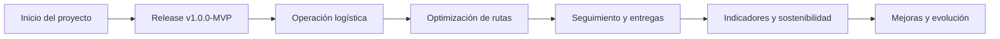
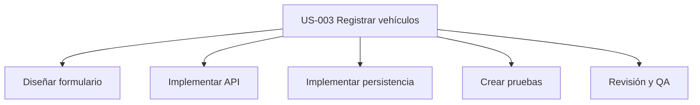
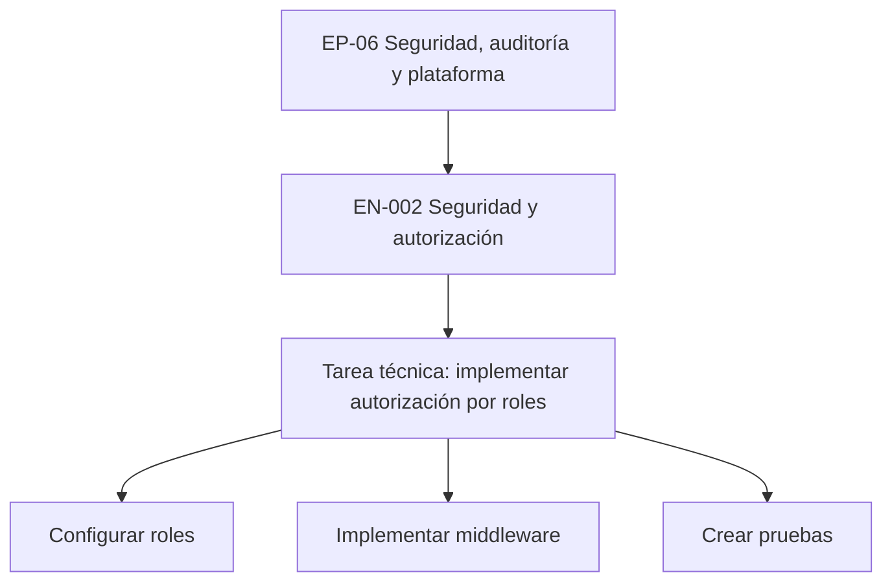
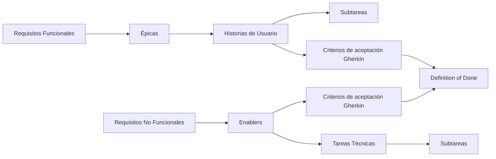

# Transformando a ágil

[← Volver al README Principal](../../README.md)

## 1. Información general

| Campo | Detalle |
|---|---|
| Proyecto | EcoLogística |
| Fase | 02 - Planificación del Proyecto |
| Enfoque | Híbrido |
| Marco de trabajo | Scrum |
| Versión | V_1_0_0 |
| Ubicación | El Tambo, Huancayo y Chilca |
| Release inicial | v1.0.0-MVP |
| Duración del Sprint 1 | 2 semanas |

---

## 2. Objetivo

El presente documento transforma los requisitos funcionales y no funcionales definidos durante la fase de inicio del proyecto EcoLogística en un backlog ágil estructurado bajo el marco de trabajo Scrum.

La transformación considera una jerarquía compuesta por Épicas, Historias de Usuario, Enablers técnicos, tareas y subtareas. Las funcionalidades se priorizan de acuerdo con el valor de negocio y el riesgo técnico, utilizando Story Points basados en la secuencia de Fibonacci: 1, 2, 3, 5, 8 y 13.

El proyecto mantiene un enfoque híbrido, combinando una planificación inicial estructurada con una ejecución iterativa e incremental mediante Scrum.

---

# 3. Transformación de requisitos a estructura ágil

## 3.1 Jerarquía Scrum del proyecto

La estructura utilizada para organizar el backlog del proyecto EcoLogística es la siguiente:

```mermaid
flowchart TD
    P[Proyecto EcoLogística]

    P --> EP01[EP-01 Gestión de acceso y usuarios]
    P --> EP02[EP-02 Gestión de operaciones logísticas]
    P --> EP03[EP-03 Planificación y optimización de rutas]
    P --> EP04[EP-04 Seguimiento y entregas]
    P --> EP05[EP-05 Indicadores y sostenibilidad]
    P --> EP06[EP-06 Seguridad, auditoría y plataforma]

    EP01 --> US001[US-001 Iniciar sesión]
    EP01 --> US002[US-002 Gestionar usuarios]

    EP02 --> US003[US-003 Registrar vehículos]
    EP02 --> US004[US-004 Registrar puntos de entrega]
    EP02 --> US005[US-005 Registrar pedidos]

    EP03 --> US006[US-006 Generar rutas]
    EP03 --> US007[US-007 Visualizar rutas]
    EP03 --> US008[US-008 Reoptimizar rutas]

    EP04 --> US009[US-009 Consultar pedidos]
    EP04 --> US010[US-010 Registrar entregas]

    EP05 --> US011[US-011 Consultar indicadores]
    EP05 --> US012[US-012 Consultar indicadores ambientales]
    EP05 --> US013[US-013 Exportar información]

    EP06 --> US014[US-014 Consultar auditoría]
    EP06 --> US015[US-015 Configurar parámetros]
```



### Interpretación de la jerarquía

- **Épica:** representa un bloque funcional importante del proyecto.
- **Historia de Usuario:** representa una funcionalidad que entrega valor a un usuario.
- **Enabler:** representa trabajo técnico necesario para soportar la solución.
- **Tarea:** representa un trabajo técnico específico.
- **Subtarea:** representa una actividad pequeña derivada de una Historia de Usuario o tarea.
- **Bug:** representa un incidente o defecto detectado durante el desarrollo o las pruebas.

Las subtareas tendrán una duración máxima de **8 horas**.

---

# 4. Mapeo de requisitos funcionales a Épicas

Los requisitos funcionales se agrupan de acuerdo con su propósito dentro del sistema.

| Requisito | Épica | Justificación |
|---|---|---|
| RF-001 | EP-01 Gestión de acceso y usuarios | Permite gestionar el acceso al sistema. |
| RF-002 | EP-01 Gestión de acceso y usuarios | Permite administrar la información de los usuarios. |
| RF-003 | EP-02 Gestión de operaciones logísticas | Permite registrar los vehículos utilizados. |
| RF-004 | EP-02 Gestión de operaciones logísticas | Permite registrar los puntos de entrega. |
| RF-005 | EP-02 Gestión de operaciones logísticas | Permite gestionar los pedidos. |
| RF-006 | EP-03 Planificación y optimización de rutas | Permite generar rutas para las operaciones. |
| RF-007 | EP-04 Seguimiento y entregas | Permite realizar seguimiento de los pedidos. |
| RF-008 | EP-03 Planificación y optimización de rutas | Permite visualizar las rutas generadas. |
| RF-009 | EP-04 Seguimiento y entregas | Permite registrar el resultado de las entregas. |
| RF-010 | EP-04 Seguimiento y entregas | Permite consultar el estado de los pedidos. |
| RF-011 | EP-05 Indicadores y sostenibilidad | Permite consultar indicadores operativos. |
| RF-012 | EP-05 Indicadores y sostenibilidad | Permite consultar indicadores ambientales. |
| RF-013 | EP-06 Seguridad, auditoría y plataforma | Permite exportar información del sistema. |
| RF-014 | EP-06 Seguridad, auditoría y plataforma | Permite consultar registros de auditoría. |
| RF-015 | EP-06 Seguridad, auditoría y plataforma | Permite configurar parámetros del sistema. |

---

# 5. Épicas del proyecto

## EP-01 Gestión de acceso y usuarios

Esta épica comprende las funcionalidades relacionadas con la autenticación y administración de usuarios del sistema.

### Historias relacionadas

- US-001 Iniciar sesión
- US-002 Gestionar usuarios

---

## EP-02 Gestión de operaciones logísticas

Esta épica comprende el registro y administración de los recursos y elementos necesarios para realizar las operaciones logísticas.

### Historias relacionadas

- US-003 Registrar vehículos
- US-004 Registrar puntos de entrega
- US-005 Registrar pedidos

---

## EP-03 Planificación y optimización de rutas

Esta épica comprende las funcionalidades orientadas a generar, visualizar y optimizar las rutas de distribución.

### Historias relacionadas

- US-006 Generar rutas
- US-007 Visualizar rutas
- US-008 Reoptimizar rutas

---

## EP-04 Seguimiento y entregas

Esta épica comprende las funcionalidades relacionadas con el seguimiento de pedidos y el registro de las entregas.

### Historias relacionadas

- US-009 Consultar pedidos
- US-010 Registrar entregas

---

## EP-05 Indicadores y sostenibilidad

Esta épica comprende las funcionalidades de análisis de información operativa y ambiental.

### Historias relacionadas

- US-011 Consultar indicadores
- US-012 Consultar indicadores ambientales
- US-013 Exportar información

---

## EP-06 Seguridad, auditoría y plataforma

Esta épica comprende funcionalidades de administración, auditoría y soporte técnico de la plataforma.

### Historias relacionadas

- US-014 Consultar auditoría
- US-015 Configurar parámetros

---

# 6. Historias de Usuario

## US-001 - Iniciar sesión

**ID:** US-001  
**Título:** Iniciar sesión  
**Épica Relacionada:** EP-01 Gestión de acceso y usuarios

### Redacción

**Como** usuario registrado,  
**quiero** iniciar sesión mediante mis credenciales,  
**para** acceder de manera segura a las funcionalidades del sistema.

### Criterios de aceptación

```gherkin
Escenario: Inicio de sesión exitoso
Dado que el usuario tiene credenciales válidas
Cuando ingresa su usuario y contraseña correctos
Entonces el sistema permite el acceso a la plataforma

Escenario: Credenciales incorrectas
Dado que el usuario ingresa credenciales inválidas
Cuando intenta iniciar sesión
Entonces el sistema muestra un mensaje indicando que las credenciales no son válidas
```

---

## US-002 - Gestionar usuarios

**ID:** US-002  
**Título:** Gestionar usuarios  
**Épica Relacionada:** EP-01 Gestión de acceso y usuarios

### Redacción

**Como** administrador,  
**quiero** registrar, modificar y gestionar usuarios,  
**para** controlar quién puede utilizar el sistema.

### Criterios de aceptación

```gherkin
Escenario: Registrar usuario
Dado que el administrador se encuentra en la gestión de usuarios
Cuando registra los datos válidos de un nuevo usuario
Entonces el sistema crea el usuario correctamente

Escenario: Modificar usuario
Dado que existe un usuario registrado
Cuando el administrador modifica sus datos
Entonces el sistema guarda la información actualizada
```

---

## US-003 - Registrar vehículos

**ID:** US-003  
**Título:** Registrar vehículos  
**Épica Relacionada:** EP-02 Gestión de operaciones logísticas

### Redacción

**Como** responsable logístico,  
**quiero** registrar los vehículos disponibles,  
**para** utilizarlos en la planificación de las rutas.

### Criterios de aceptación

```gherkin
Escenario: Registrar vehículo válido
Dado que el responsable logístico se encuentra en el módulo de vehículos
Cuando ingresa información válida del vehículo
Entonces el sistema registra el vehículo

Escenario: Validar datos obligatorios
Dado que el responsable intenta registrar un vehículo
Cuando omite un dato obligatorio
Entonces el sistema solicita completar la información requerida
```

---

## US-004 - Registrar puntos de entrega

**ID:** US-004  
**Título:** Registrar puntos de entrega  
**Épica Relacionada:** EP-02 Gestión de operaciones logísticas

### Redacción

**Como** responsable logístico,  
**quiero** registrar los puntos de entrega,  
**para** disponer de destinos válidos para la planificación de rutas.

### Criterios de aceptación

```gherkin
Escenario: Registrar punto de entrega
Dado que el usuario se encuentra en el módulo de puntos de entrega
Cuando ingresa una dirección y datos válidos
Entonces el sistema registra el punto de entrega

Escenario: Validar ubicación
Dado que el usuario intenta registrar un punto de entrega
Cuando la información de ubicación es incompleta
Entonces el sistema solicita completar los datos requeridos
```

---

## US-005 - Registrar pedidos

**ID:** US-005  
**Título:** Registrar pedidos  
**Épica Relacionada:** EP-02 Gestión de operaciones logísticas

### Redacción

**Como** responsable logístico,  
**quiero** registrar pedidos,  
**para** incorporarlos posteriormente a la planificación de distribución.

### Criterios de aceptación

```gherkin
Escenario: Registrar pedido
Dado que existe un punto de entrega registrado
Cuando el usuario registra un pedido con información válida
Entonces el sistema almacena el pedido correctamente

Escenario: Pedido con información incompleta
Dado que el usuario intenta registrar un pedido
Cuando omite información obligatoria
Entonces el sistema impide el registro y muestra los campos requeridos
```

---

## US-006 - Generar rutas

**ID:** US-006  
**Título:** Generar rutas  
**Épica Relacionada:** EP-03 Planificación y optimización de rutas

### Redacción

**Como** responsable logístico,  
**quiero** generar rutas considerando los pedidos y vehículos disponibles,  
**para** planificar una distribución eficiente.

### Criterios de aceptación

```gherkin
Escenario: Generar ruta
Dado que existen pedidos y vehículos disponibles
Cuando el responsable ejecuta la planificación
Entonces el sistema genera una propuesta de ruta

Escenario: Sin recursos suficientes
Dado que existen pedidos pendientes
Cuando no existen vehículos disponibles
Entonces el sistema informa que no es posible generar la ruta
```

---

## US-007 - Visualizar rutas

**ID:** US-007  
**Título:** Visualizar rutas  
**Épica Relacionada:** EP-03 Planificación y optimización de rutas

### Redacción

**Como** responsable logístico,  
**quiero** visualizar las rutas planificadas,  
**para** conocer el recorrido asignado a cada vehículo.

### Criterios de aceptación

```gherkin
Escenario: Visualizar ruta generada
Dado que existe una ruta planificada
Cuando el usuario consulta la ruta
Entonces el sistema muestra su recorrido y puntos de entrega

Escenario: Consultar ruta inexistente
Dado que no existe una ruta planificada
Cuando el usuario consulta las rutas
Entonces el sistema informa que no existen rutas disponibles
```

---

## US-008 - Reoptimizar rutas

**ID:** US-008  
**Título:** Reoptimizar rutas  
**Épica Relacionada:** EP-03 Planificación y optimización de rutas

### Redacción

**Como** responsable logístico,  
**quiero** reoptimizar una ruta ante cambios operativos,  
**para** reducir recorridos innecesarios y mejorar la eficiencia de la distribución.

### Criterios de aceptación

```gherkin
Escenario: Reoptimizar ruta
Dado que existe una ruta previamente generada
Cuando se solicita una nueva optimización
Entonces el sistema genera una propuesta actualizada

Escenario: Cambio en los pedidos
Dado que una ruta contiene pedidos modificados
Cuando el usuario solicita la reoptimización
Entonces el sistema considera los cambios en la nueva propuesta
```

---

## US-009 - Consultar pedidos

**ID:** US-009  
**Título:** Consultar pedidos  
**Épica Relacionada:** EP-04 Seguimiento y entregas

### Redacción

**Como** responsable logístico,  
**quiero** consultar el estado de los pedidos,  
**para** realizar el seguimiento de las operaciones de distribución.

### Criterios de aceptación

```gherkin
Escenario: Consultar pedidos registrados
Dado que existen pedidos registrados
Cuando el usuario accede al listado
Entonces el sistema muestra los pedidos y su estado

Escenario: Filtrar pedidos
Dado que existen múltiples pedidos
Cuando el usuario aplica un filtro válido
Entonces el sistema muestra únicamente los pedidos que cumplen el criterio
```

---

## US-010 - Registrar entregas

**ID:** US-010  
**Título:** Registrar entregas  
**Épica Relacionada:** EP-04 Seguimiento y entregas

### Redacción

**Como** responsable de distribución,  
**quiero** registrar el resultado de una entrega,  
**para** mantener actualizado el estado de los pedidos.

### Criterios de aceptación

```gherkin
Escenario: Registrar entrega exitosa
Dado que existe un pedido pendiente
Cuando el responsable registra la entrega como completada
Entonces el sistema actualiza el pedido como entregado

Escenario: Registrar entrega no completada
Dado que existe un pedido asignado
Cuando el responsable registra una incidencia
Entonces el sistema conserva la información de la incidencia
```

---

## US-011 - Consultar indicadores

**ID:** US-011  
**Título:** Consultar indicadores  
**Épica Relacionada:** EP-05 Indicadores y sostenibilidad

### Redacción

**Como** administrador o responsable logístico,  
**quiero** consultar indicadores operativos,  
**para** evaluar el desempeño de las operaciones.

### Criterios de aceptación

```gherkin
Escenario: Consultar indicadores
Dado que existen datos operativos registrados
Cuando el usuario accede al módulo de indicadores
Entonces el sistema muestra los indicadores calculados

Escenario: Sin información suficiente
Dado que no existen datos suficientes para calcular un indicador
Cuando el usuario consulta los indicadores
Entonces el sistema informa que no existe información suficiente
```

---

## US-012 - Consultar indicadores ambientales

**ID:** US-012  
**Título:** Consultar indicadores ambientales  
**Épica Relacionada:** EP-05 Indicadores y sostenibilidad

### Redacción

**Como** responsable logístico,  
**quiero** consultar indicadores ambientales de las operaciones,  
**para** evaluar el impacto de las rutas y promover una distribución sostenible.

### Criterios de aceptación

```gherkin
Escenario: Consultar indicadores ambientales
Dado que existen datos de las operaciones realizadas
Cuando el usuario consulta los indicadores ambientales
Entonces el sistema muestra los indicadores disponibles

Escenario: Comparar resultados ambientales
Dado que existen datos de diferentes periodos
Cuando el usuario selecciona un periodo de consulta
Entonces el sistema muestra la información correspondiente al periodo seleccionado
```

---

## US-013 - Exportar información

**ID:** US-013  
**Título:** Exportar información  
**Épica Relacionada:** EP-05 Indicadores y sostenibilidad

### Redacción

**Como** administrador,  
**quiero** exportar información del sistema,  
**para** utilizar los datos en reportes y análisis externos.

### Criterios de aceptación

```gherkin
Escenario: Exportar información
Dado que existen datos disponibles
Cuando el usuario solicita una exportación
Entonces el sistema genera el archivo correspondiente

Escenario: Exportar información filtrada
Dado que el usuario ha aplicado filtros
Cuando solicita la exportación
Entonces el archivo contiene únicamente la información filtrada
```

---

## US-014 - Consultar auditoría

**ID:** US-014  
**Título:** Consultar auditoría  
**Épica Relacionada:** EP-06 Seguridad, auditoría y plataforma

### Redacción

**Como** administrador,  
**quiero** consultar los registros de auditoría,  
**para** conocer las acciones realizadas dentro del sistema.

### Criterios de aceptación

```gherkin
Escenario: Consultar registros
Dado que existen registros de auditoría
Cuando el administrador accede al módulo
Entonces el sistema muestra las acciones registradas

Escenario: Filtrar registros
Dado que existen múltiples registros
Cuando el administrador aplica un filtro
Entonces el sistema muestra los registros correspondientes al criterio seleccionado
```

---

## US-015 - Configurar parámetros

**ID:** US-015  
**Título:** Configurar parámetros  
**Épica Relacionada:** EP-06 Seguridad, auditoría y plataforma

### Redacción

**Como** administrador,  
**quiero** configurar parámetros generales del sistema,  
**para** adaptar la plataforma a las necesidades operativas.

### Criterios de aceptación

```gherkin
Escenario: Actualizar parámetros
Dado que el administrador tiene permisos de configuración
Cuando modifica un parámetro con un valor válido
Entonces el sistema guarda la configuración

Escenario: Valor inválido
Dado que el administrador modifica un parámetro
Cuando ingresa un valor no permitido
Entonces el sistema rechaza el cambio y muestra un mensaje de validación
```

---

# 7. Transformación de requisitos no funcionales a Enablers

Los requisitos no funcionales se convierten principalmente en **Enablers técnicos**, debido a que representan capacidades necesarias para garantizar calidad, seguridad, rendimiento, disponibilidad y mantenibilidad.

| RNF | Enabler | Tipo |
|---|---|---|
| RNF-001 | EN-001 Rendimiento de consultas | Performance |
| RNF-002 | EN-002 Seguridad y autorización | Seguridad |
| RNF-003 | EN-003 Disponibilidad | Infraestructura |
| RNF-004 | EN-004 Integridad de datos | Arquitectura / Base de datos |
| RNF-005 | EN-005 Pruebas de usabilidad | Calidad |
| RNF-006 | EN-006 Compatibilidad web | Infraestructura |
| RNF-007 | EN-007 Mantenibilidad | Arquitectura |
| RNF-008 | EN-008 Pruebas de carga | Performance |
| RNF-009 | EN-009 Recuperación | Infraestructura |
| RNF-010 | EN-010 Auditoría | Seguridad |
| RNF-011 | EN-011 Protección de información | Seguridad |
| RNF-012 | EN-012 Optimización de consumo | Sostenibilidad |

---

# 8. Enablers técnicos

## EN-001 - Rendimiento de consultas

**ID:** EN-001  
**Título:** Rendimiento de consultas

### Objetivo

Garantizar tiempos de respuesta adecuados para las consultas principales del sistema.

### Criterios de aceptación

```gherkin
Escenario: Consulta dentro del tiempo esperado
Dado que existe información almacenada
Cuando el usuario ejecuta una consulta principal
Entonces el sistema responde dentro del tiempo definido para la operación

Escenario: Consulta optimizada
Dado que existen grandes cantidades de registros
Cuando el usuario realiza una consulta
Entonces el sistema utiliza mecanismos de optimización para evitar tiempos excesivos
```

---

## EN-002 - Seguridad y autorización

**ID:** EN-002  
**Título:** Seguridad y autorización

### Objetivo

Implementar mecanismos de autenticación y autorización según el rol del usuario.

### Criterios de aceptación

```gherkin
Escenario: Acceso autorizado
Dado que el usuario tiene un rol válido
Cuando accede a una funcionalidad permitida
Entonces el sistema permite el acceso

Escenario: Acceso no autorizado
Dado que el usuario no tiene permisos suficientes
Cuando intenta acceder a una funcionalidad restringida
Entonces el sistema deniega el acceso
```

---

## EN-003 - Disponibilidad

**ID:** EN-003  
**Título:** Disponibilidad

### Objetivo

Mantener la plataforma disponible para los usuarios autorizados.

### Criterios de aceptación

```gherkin
Escenario: Acceso a la plataforma
Dado que la infraestructura se encuentra operativa
Cuando un usuario autorizado accede al sistema
Entonces la plataforma se encuentra disponible

Escenario: Recuperación del servicio
Dado que ocurre una interrupción controlada del servicio
Cuando la infraestructura se recupera
Entonces el sistema vuelve a estar disponible
```

---

## EN-004 - Integridad de datos

**ID:** EN-004  
**Título:** Integridad de datos

### Objetivo

Asegurar que la información almacenada mantenga relaciones y restricciones consistentes.

### Criterios de aceptación

```gherkin
Escenario: Registro consistente
Dado que un usuario registra información válida
Cuando se almacena el registro
Entonces el sistema mantiene las relaciones correspondientes en la base de datos

Escenario: Información inválida
Dado que un usuario intenta guardar información que viola una restricción
Cuando realiza el registro
Entonces el sistema rechaza la operación
```

---

## EN-005 - Pruebas de usabilidad

**ID:** EN-005  
**Título:** Pruebas de usabilidad

### Objetivo

Verificar que las principales funcionalidades sean comprensibles y utilizables.

### Criterios de aceptación

```gherkin
Escenario: Navegación de una funcionalidad
Dado que el usuario accede al sistema
Cuando utiliza una funcionalidad principal
Entonces puede completar el flujo sin instrucciones técnicas adicionales

Escenario: Validación de formularios
Dado que el usuario completa un formulario
Cuando ingresa información inválida
Entonces el sistema muestra mensajes comprensibles
```

---

## EN-006 - Compatibilidad web

**ID:** EN-006  
**Título:** Compatibilidad web

### Objetivo

Garantizar el funcionamiento de la aplicación en navegadores web compatibles.

### Criterios de aceptación

```gherkin
Escenario: Acceso desde navegador compatible
Dado que el usuario utiliza un navegador soportado
Cuando accede al sistema
Entonces la aplicación funciona correctamente

Escenario: Visualización responsive
Dado que el usuario accede desde una pantalla diferente
Cuando utiliza la plataforma
Entonces la interfaz mantiene una presentación funcional
```

---

## EN-007 - Mantenibilidad

**ID:** EN-007  
**Título:** Mantenibilidad

### Objetivo

Establecer una estructura de código que facilite futuras modificaciones.

### Criterios de aceptación

```gherkin
Escenario: Modificación de un módulo
Dado que existe una funcionalidad implementada
Cuando un desarrollador realiza un cambio
Entonces puede modificar el módulo sin afectar funcionalidades no relacionadas

Escenario: Revisión de código
Dado que existe un cambio pendiente
Cuando se realiza una revisión mediante Pull Request
Entonces el cambio puede ser evaluado antes de integrarse
```

---

## EN-008 - Pruebas de carga

**ID:** EN-008  
**Título:** Pruebas de carga

### Objetivo

Evaluar el comportamiento de la aplicación ante diferentes niveles de demanda.

### Criterios de aceptación

```gherkin
Escenario: Prueba con carga esperada
Dado que el sistema recibe una cantidad esperada de solicitudes
Cuando se ejecuta la prueba de carga
Entonces el sistema mantiene un funcionamiento estable

Escenario: Identificación de degradación
Dado que la carga supera el escenario esperado
Cuando se ejecuta la prueba
Entonces se identifican los puntos de degradación del sistema
```

---

## EN-009 - Recuperación

**ID:** EN-009  
**Título:** Recuperación

### Objetivo

Permitir la recuperación de información y servicios ante incidentes.

### Criterios de aceptación

```gherkin
Escenario: Recuperación de información
Dado que existe una copia de respaldo válida
Cuando ocurre una pérdida controlada de información
Entonces el sistema puede recuperar los datos desde el respaldo

Escenario: Verificación de respaldo
Dado que se genera una copia de seguridad
Cuando se valida el respaldo
Entonces el sistema confirma que el proceso se realizó correctamente
```

---

## EN-010 - Auditoría

**ID:** EN-010  
**Título:** Auditoría

### Objetivo

Registrar las operaciones relevantes realizadas por los usuarios.

### Criterios de aceptación

```gherkin
Escenario: Registrar acción
Dado que un usuario realiza una operación relevante
Cuando la operación finaliza
Entonces el sistema registra la acción correspondiente

Escenario: Consultar acción
Dado que existe un registro de auditoría
Cuando el administrador consulta el historial
Entonces puede visualizar la acción registrada
```

---

## EN-011 - Protección de información

**ID:** EN-011  
**Título:** Protección de información

### Objetivo

Proteger la información almacenada y transmitida por la aplicación.

### Criterios de aceptación

```gherkin
Escenario: Protección de credenciales
Dado que un usuario registra una contraseña
Cuando la información se almacena
Entonces la contraseña no se guarda en texto plano

Escenario: Protección de acceso
Dado que un usuario no autenticado intenta acceder a información protegida
Cuando realiza la solicitud
Entonces el sistema rechaza el acceso
```

---

## EN-012 - Optimización de consumo

**ID:** EN-012  
**Título:** Optimización de consumo

### Objetivo

Promover un uso eficiente de los recursos computacionales y apoyar el objetivo de sostenibilidad del proyecto.

### Criterios de aceptación

```gherkin
Escenario: Procesamiento eficiente
Dado que el sistema ejecuta una operación logística
Cuando procesa la información
Entonces utiliza los recursos necesarios evitando operaciones innecesarias

Escenario: Optimización de rutas
Dado que existen alternativas de recorrido
Cuando se ejecuta la planificación
Entonces el sistema considera criterios orientados a reducir recorridos innecesarios
```

---

# 9. Definition of Done (DoD)

Una Historia de Usuario, Enabler o tarea se considera terminada únicamente cuando cumple con los siguientes criterios:

1. La funcionalidad solicitada se encuentra implementada.
2. Los criterios de aceptación definidos en Gherkin han sido satisfechos.
3. Las pruebas unitarias correspondientes han sido implementadas.
4. La cobertura de pruebas unitarias es igual o superior al **80 %**.
5. Se realizó análisis estático mediante **SonarQube, CodeQL o herramienta equivalente**.
6. No existen vulnerabilidades críticas pendientes.
7. El código fue integrado mediante un **Pull Request**.
8. El Pull Request fue aprobado por al menos un integrante técnico mediante revisión por pares.
9. La funcionalidad se encuentra desplegada y ejecutable en el ambiente de **Staging/Test**.
10. La documentación técnica y del código se encuentra actualizada.
11. La documentación de API mediante **OpenAPI/Swagger** se encuentra actualizada cuando corresponde.
12. No existen defectos críticos o bloqueantes pendientes.
13. El cambio se encuentra integrado en la rama correspondiente.
14. La funcionalidad puede ser demostrada durante la revisión del Sprint.

---

# 10. Tipos de elementos utilizados en Jira

| Elemento | Uso en EcoLogística |
|---|---|
| Epic | Agrupa un bloque funcional principal del sistema. |
| Story | Representa una funcionalidad desde la perspectiva del usuario. |
| Enabler / Task | Representa trabajo técnico de arquitectura, DevOps, base de datos o infraestructura. |
| Sub-task | Divide una Story o Task en actividades pequeñas de máximo 8 horas. |
| Bug | Registra errores o incidentes encontrados durante el desarrollo o pruebas. |

---

# 11. Backlog priorizado

La priorización considera principalmente:

- Valor para el negocio.
- Dependencias funcionales.
- Riesgo técnico.
- Necesidad para el MVP.
- Complejidad estimada.

La estimación utiliza Story Points según la secuencia de Fibonacci:

**1, 2, 3, 5, 8 y 13.**

| Prioridad | ID | Tipo | Elemento | Story Points |
|---:|---|---|---|---:|
| 1 | US-001 | Story | Iniciar sesión | 3 |
| 2 | US-003 | Story | Registrar vehículos | 3 |
| 3 | US-004 | Story | Registrar puntos de entrega | 5 |
| 4 | US-005 | Story | Registrar pedidos | 5 |
| 5 | US-002 | Story | Gestionar usuarios | 5 |
| 6 | US-006 | Story | Generar rutas | 13 |
| 7 | US-007 | Story | Visualizar rutas | 5 |
| 8 | US-009 | Story | Consultar pedidos | 3 |
| 9 | US-010 | Story | Registrar entregas | 5 |
| 10 | US-008 | Story | Reoptimizar rutas | 13 |
| 11 | US-011 | Story | Consultar indicadores | 5 |
| 12 | US-012 | Story | Consultar indicadores ambientales | 5 |
| 13 | US-013 | Story | Exportar información | 3 |
| 14 | US-014 | Story | Consultar auditoría | 3 |
| 15 | US-015 | Story | Configurar parámetros | 5 |

Los elementos técnicos Enabler se gestionarán en Jira de acuerdo con las dependencias de las Historias de Usuario.

---

# 12. Componentes del backlog

Para facilitar la organización en Jira se proponen los siguientes componentes:

| Componente | Descripción |
|---|---|
| Autenticación | Acceso y gestión de credenciales. |
| Usuarios | Administración de usuarios y roles. |
| Operaciones | Vehículos, pedidos y puntos de entrega. |
| Rutas | Generación, visualización y optimización. |
| Entregas | Seguimiento y registro de entregas. |
| Indicadores | Indicadores operativos y ambientales. |
| Seguridad | Autorización, protección y auditoría. |
| Base de datos | Persistencia, integridad y respaldos. |
| Infraestructura | Despliegue, disponibilidad y recuperación. |
| Calidad | Pruebas, análisis estático y calidad de software. |

---

# 13. Roadmap del proyecto

El roadmap se organiza en entregas incrementales, manteniendo el enfoque híbrido del proyecto.



### Etapas principales

| Etapa | Objetivo |
|---|---|
| Inicio | Definición de alcance, requisitos, arquitectura, riesgos y planificación inicial. |
| v1.0.0-MVP | Construcción del núcleo operativo inicial. |
| Operación logística | Gestión de vehículos, puntos de entrega y pedidos. |
| Optimización de rutas | Generación, visualización y reoptimización de rutas. |
| Seguimiento y entregas | Control de pedidos y registro de entregas. |
| Indicadores y sostenibilidad | Análisis operativo y ambiental. |
| Mejoras y evolución | Incorporación de mejoras según retroalimentación y resultados. |

---

# 14. Release inicial

## v1.0.0-MVP

El primer release se define como:

**v1.0.0-MVP - Núcleo operativo inicial de EcoLogística**

El MVP debe permitir como mínimo:

- Iniciar sesión.
- Gestionar usuarios.
- Registrar vehículos.
- Registrar puntos de entrega.
- Registrar pedidos.
- Preparar la información necesaria para la planificación de rutas.

El objetivo es contar con una base funcional que permita posteriormente implementar y validar la generación y optimización de rutas.

---

# 15. Sprint 1

## Duración

**2 semanas**

## Sprint Goal

> **Construir el núcleo operativo inicial de EcoLogística permitiendo autenticar usuarios, registrar vehículos, puntos de entrega y pedidos, dejando la información preparada para la primera planificación de rutas.**

### Historias propuestas para Sprint 1

| ID | Historia | Story Points |
|---|---|---:|
| US-001 | Iniciar sesión | 3 |
| US-003 | Registrar vehículos | 3 |
| US-004 | Registrar puntos de entrega | 5 |
| US-005 | Registrar pedidos | 5 |

**Total:** 16 Story Points.

### Enablers técnicos asociados

Durante el Sprint 1 también pueden incorporarse Enablers técnicos necesarios para soportar las historias:

- EN-002 Seguridad y autorización.
- EN-004 Integridad de datos.
- EN-007 Mantenibilidad.
- EN-011 Protección de información.

---

# 16. Flujo del tablero Scrum

El tablero de Jira utilizará las siguientes columnas:


### Descripción

| Columna | Descripción |
|---|---|
| To Do | Elementos seleccionados para realizar, pero todavía no iniciados. |
| In Progress | Elementos actualmente en desarrollo. |
| In Review / QA | Elementos terminados por desarrollo y pendientes de revisión técnica o pruebas. |
| Done | Elementos que cumplen completamente la Definition of Done. |

---

# 17. Subtareas

Las Historias de Usuario y tareas técnicas podrán dividirse en subtareas cuando sea necesario.

Cada subtarea tendrá una duración máxima de **8 horas**.

Ejemplo:



Las subtareas permiten distribuir el trabajo entre los integrantes del equipo sin modificar el objetivo principal de la Historia de Usuario.

---

# 18. Ejemplo de Enabler técnico



Este tipo de trabajo no representa directamente una funcionalidad solicitada por un usuario final, sino una capacidad técnica necesaria para garantizar la seguridad del sistema.

---

# 19. Gestión de Bugs

Los defectos encontrados durante el desarrollo, pruebas o revisión serán registrados en Jira como **Bug**.

### Ejemplo

```text
Tipo: Bug
Título: El sistema permite acceder al módulo de usuarios sin autorización
Prioridad: Alta
Componente: Seguridad
Descripción: Un usuario sin permisos administrativos puede acceder al módulo de gestión de usuarios.
Criterio de solución: El sistema debe bloquear el acceso y mostrar un mensaje de autorización.
```

El Bug deberá pasar por el mismo flujo del tablero:

**To Do → In Progress → In Review / QA → Done**

---

# 20. Criterios de priorización

La prioridad de los elementos se establece considerando:

1. Valor de negocio.
2. Dependencias entre funcionalidades.
3. Riesgo técnico.
4. Impacto en el MVP.
5. Complejidad de implementación.
6. Necesidad de validación temprana.

Las funcionalidades críticas para construir el núcleo operativo se colocan primero, mientras que las funcionalidades de análisis, exportación y configuración se incorporan posteriormente.

---

# 21. Enfoque híbrido

EcoLogística mantiene un enfoque híbrido porque combina planificación estructurada y ejecución iterativa.

La planificación inicial permite establecer:

- Alcance general.
- Requisitos.
- Arquitectura.
- Riesgos.
- Presupuesto.
- Restricciones.

Posteriormente, Scrum permite adaptar y priorizar el trabajo mediante:

- Product Backlog.
- Sprint Planning.
- Daily Scrum.
- Sprint Goal.
- Sprint Review.
- Sprint Retrospective.
- Incrementos funcionales.

Esta combinación permite mantener una dirección general definida, pero al mismo tiempo incorporar cambios y retroalimentación durante el desarrollo.

---

# 22. Relación entre requisitos y backlog



Esta transformación permite conservar la trazabilidad entre los requisitos definidos durante la fase de inicio y los elementos gestionados posteriormente en Jira.

---

# 23. Trazabilidad general

| Elemento de origen | Elemento ágil | Gestión |
|---|---|---|
| RF-001 | US-001 | Story |
| RF-002 | US-002 | Story |
| RF-003 | US-003 | Story |
| RF-004 | US-004 | Story |
| RF-005 | US-005 | Story |
| RF-006 | US-006 | Story |
| RF-007 | US-009 | Story |
| RF-008 | US-007 | Story |
| RF-009 | US-010 | Story |
| RF-010 | US-009 | Story |
| RF-011 | US-011 | Story |
| RF-012 | US-012 | Story |
| RF-013 | US-013 | Story |
| RF-014 | US-014 | Story |
| RF-015 | US-015 | Story |
| RNF-001 | EN-001 | Enabler |
| RNF-002 | EN-002 | Enabler |
| RNF-003 | EN-003 | Enabler |
| RNF-004 | EN-004 | Enabler |
| RNF-005 | EN-005 | Enabler |
| RNF-006 | EN-006 | Enabler |
| RNF-007 | EN-007 | Enabler |
| RNF-008 | EN-008 | Enabler |
| RNF-009 | EN-009 | Enabler |
| RNF-010 | EN-010 | Enabler |
| RNF-011 | EN-011 | Enabler |
| RNF-012 | EN-012 | Enabler |

---

# 24. Conclusión

La transformación realizada convierte los requisitos iniciales de EcoLogística en una estructura de trabajo ágil compatible con Scrum.

Las funcionalidades se organizan mediante Épicas e Historias de Usuario, mientras que los requisitos no funcionales se gestionan mediante Enablers técnicos. Cada Historia de Usuario y Enabler cuenta con criterios de aceptación en formato Gherkin y se somete a una Definition of Done común.

El backlog priorizado permite iniciar el desarrollo con un Sprint 1 orientado a construir el núcleo operativo del sistema. Posteriormente, las iteraciones permitirán desarrollar la generación y optimización de rutas, el seguimiento de entregas y los indicadores de sostenibilidad.

La estructura propuesta mantiene el enfoque híbrido del proyecto, combinando la planificación inicial con una ejecución iterativa y adaptable.

---

[← Volver al README Principal](../../README.md)