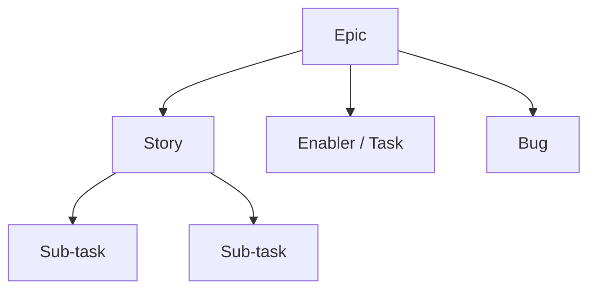
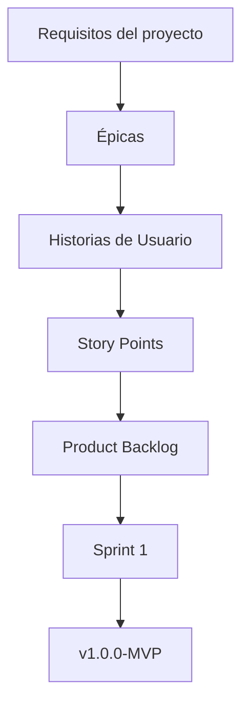

# Artefactos Jira

[← Volver al README Principal](../../README.md)

## 1. Información general

| Campo | Información |
|---|---|
| Proyecto | EcoLogística |
| Fase | 02 - Planificación del Proyecto |
| Enfoque | Híbrido |
| Herramienta | Jira |
| Metodología | Scrum |
| Release | v1.0.0-MVP |
| Sprint inicial | Sprint 1 |
| Duración | 2 semanas |
| Ámbito | El Tambo, Huancayo y Chilca |
| Versión del documento | V_1_0_0 |

---

# 2. Configuración del proyecto en Jira

El proyecto EcoLogística será gestionado en Jira mediante un proyecto basado en Scrum. Esta configuración permitirá organizar, priorizar, estimar y realizar seguimiento de las actividades necesarias para desarrollar el sistema.

La estructura de trabajo seguirá la siguiente jerarquía:



Los elementos principales utilizados serán:

| Elemento | Descripción |
|---|---|
| Epic | Representa un bloque funcional importante del proyecto. |
| Story | Representa una funcionalidad desde la perspectiva del usuario. |
| Enabler / Task | Representa trabajo técnico necesario para soportar la solución. |
| Sub-task | Representa una actividad derivada de una Story o Task, con duración máxima de 8 horas. |
| Bug | Representa un defecto o incidente detectado durante el desarrollo o pruebas. |

---

# 3. Flujo del tablero Scrum

El tablero Scrum utilizará cuatro columnas principales:


### Descripción de las columnas

| Columna | Descripción |
|---|---|
| To Do | Trabajo pendiente de iniciar. |
| In Progress | Trabajo actualmente en desarrollo. |
| In Review / QA | Trabajo implementado que se encuentra en revisión técnica o pruebas. |
| Done | Trabajo que cumple completamente la Definition of Done. |

---

# 4. Componentes

Para organizar el backlog de EcoLogística se utilizarán componentes relacionados con los principales módulos funcionales y técnicos.

| Componente | Descripción |
|---|---|
| Autenticación | Inicio de sesión y control de acceso. |
| Usuarios | Gestión de usuarios y roles. |
| Operaciones | Vehículos, puntos de entrega y pedidos. |
| Rutas | Generación, visualización y optimización de rutas. |
| Entregas | Seguimiento y registro de entregas. |
| Indicadores | Indicadores operativos y ambientales. |
| Seguridad | Seguridad, autorización y protección de información. |
| Auditoría | Trazabilidad y registros del sistema. |
| Infraestructura | Despliegue, disponibilidad y configuración técnica. |
| Base de datos | Persistencia, integridad y respaldo de información. |
| Calidad | Pruebas y validación de calidad del software. |

---

# 5. Evidencia 01 - Roadmap

## 5.1 Objetivo

Demostrar que el proyecto EcoLogística posee una planificación temporal de sus principales Épicas, funcionalidades y releases.

El Roadmap permitirá visualizar la evolución del proyecto desde la planificación inicial hasta la entrega del release **v1.0.0-MVP**.

## 5.2 Captura de Jira

> **Insertar aquí la captura real del Roadmap de Jira.**

```text
[PEGAR CAPTURA REAL DEL ROADMAP DE JIRA AQUÍ]
```

## 5.3 Información que debe mostrar la captura

La captura debe permitir identificar, cuando Jira lo permita:

- Nombre del proyecto.
- Épicas principales.
- Planificación temporal.
- Sprint o periodo correspondiente.
- Release v1.0.0-MVP.
- Relación entre las principales funcionalidades.

Las principales Épicas consideradas son:

1. EP-01 Gestión de acceso y usuarios.
2. EP-02 Gestión de operaciones logísticas.
3. EP-03 Planificación y optimización de rutas.
4. EP-04 Seguimiento y entregas.
5. EP-05 Indicadores y sostenibilidad.
6. EP-06 Seguridad, auditoría y plataforma.

## 5.4 Requisito de la captura

La captura debe mostrar únicamente el panel correspondiente al Roadmap de Jira.

**No debe aparecer:**

- Escritorio de Windows.
- Barra de tareas.
- Pestañas innecesarias del navegador.
- Ventanas externas.
- Espacios excesivos alrededor de Jira.

La captura debe estar recortada al área relevante de Jira.

---

# 6. Evidencia 02 - Backlog priorizado

## 6.1 Objetivo

Demostrar que las Historias de Usuario del proyecto se encuentran registradas en Jira, priorizadas y estimadas mediante Story Points.

## 6.2 Captura de Jira

> **Insertar aquí la captura real del backlog de Jira.**

```text
[PEGAR CAPTURA REAL DEL BACKLOG DE JIRA AQUÍ]
```

## 6.3 Elementos que deben ser visibles

La captura debe permitir identificar, cuando la configuración de Jira lo permita:

- Épicas.
- Historias de Usuario.
- Prioridad.
- Story Points.
- Componentes.
- Orden de prioridad.
- Estado de cada elemento.

## 6.4 Backlog de Historias de Usuario

| ID | Resumen | Story Points | Prioridad | Componente |
|---|---|---:|---|---|
| US-001 | Iniciar sesión | 3 | Alta | Autenticación |
| US-002 | Gestionar usuarios | 5 | Alta | Usuarios |
| US-003 | Registrar vehículos | 3 | Alta | Operaciones |
| US-004 | Registrar puntos de entrega | 5 | Alta | Operaciones |
| US-005 | Registrar pedidos | 5 | Alta | Operaciones |
| US-006 | Generar rutas | 13 | Muy Alta | Rutas |
| US-007 | Visualizar rutas | 5 | Alta | Rutas |
| US-008 | Reoptimizar rutas | 13 | Alta | Rutas |
| US-009 | Consultar pedidos | 3 | Alta | Entregas |
| US-010 | Registrar entregas | 5 | Alta | Entregas |
| US-011 | Consultar indicadores | 5 | Media | Indicadores |
| US-012 | Consultar indicadores ambientales | 5 | Media | Indicadores |
| US-013 | Exportar información | 3 | Media | Indicadores |
| US-014 | Consultar auditoría | 3 | Media | Auditoría |
| US-015 | Configurar parámetros | 5 | Baja | Seguridad |

La estimación utiliza la escala Fibonacci:

**1, 2, 3, 5, 8 y 13 Story Points.**

La priorización considera principalmente el valor de negocio, las dependencias, el riesgo técnico y la importancia de cada funcionalidad para el MVP.

---

# 7. Evidencia 03 - Sprint Planning y Sprint Goal

## 7.1 Objetivo

Demostrar la planificación del Sprint 1, incluyendo las Historias de Usuario seleccionadas y el objetivo que orientará el trabajo del equipo.

## 7.2 Sprint

**Sprint:** Sprint 1

**Duración:** 2 semanas

## 7.3 Sprint Goal

> **Construir el núcleo operativo inicial de EcoLogística permitiendo autenticar usuarios, registrar vehículos, puntos de entrega y pedidos, dejando la información preparada para la primera planificación de rutas.**

## 7.4 Trabajo planificado

El Sprint 1 estará compuesto por las siguientes Historias de Usuario:

| ID | Trabajo | Story Points |
|---|---|---:|
| US-001 | Iniciar sesión | 3 |
| US-003 | Registrar vehículos | 3 |
| US-004 | Registrar puntos de entrega | 5 |
| US-005 | Registrar pedidos | 5 |
| **Total** | **Sprint 1** | **16** |

### Enablers técnicos asociados

Los siguientes Enablers técnicos podrán ser gestionados como trabajo técnico de soporte del Sprint:

| ID | Enabler | Relación |
|---|---|---|
| EN-002 | Seguridad y autorización | Soporta autenticación y control de acceso. |
| EN-004 | Integridad de datos | Soporta la persistencia de vehículos, puntos y pedidos. |
| EN-007 | Mantenibilidad | Facilita la construcción y evolución de las funcionalidades. |
| EN-011 | Protección de información | Protege la información gestionada por el sistema. |

Los Enablers técnicos se gestionarán en Jira como elementos técnicos y se asignarán de acuerdo con las necesidades y dependencias del Sprint.

## 7.5 Captura de Jira

> **Insertar aquí la captura real del Sprint Planning de Jira.**

```text
[PEGAR CAPTURA REAL DEL SPRINT PLANNING AQUÍ]
```

La captura debe mostrar el **Sprint 1**, las actividades seleccionadas y, cuando sea posible, el **Sprint Goal**.

## 7.6 Requisito de la captura

La captura debe estar recortada únicamente al panel correspondiente de Jira.

No deben aparecer:

- Escritorio.
- Barra de tareas.
- Otras ventanas.
- Pestañas innecesarias.
- Espacios excesivos.

---

# 8. Evidencia 04 - Scrum Board activo

## 8.1 Objetivo

Demostrar que el tablero Scrum se encuentra configurado y que las actividades pueden gestionarse mediante un flujo de trabajo definido.

## 8.2 Flujo del tablero


## 8.3 Captura de Jira

> **Insertar aquí la captura real del tablero Scrum activo.**

```text
[PEGAR CAPTURA REAL DEL SCRUM BOARD AQUÍ]
```

## 8.4 Descripción del tablero

El tablero permitirá visualizar el estado de cada Story, Enabler, Task o Bug.

### To Do

Representa el trabajo pendiente que ha sido seleccionado o planificado, pero todavía no ha comenzado.

### In Progress

Representa las actividades que actualmente se encuentran en desarrollo.

### In Review / QA

Representa actividades implementadas que deben pasar por revisión técnica, pruebas funcionales o control de calidad.

### Done

Representa elementos que cumplen todos los criterios establecidos en la Definition of Done.

## 8.5 Requisito de la captura

La captura debe mostrar únicamente el tablero Scrum de Jira.

Debe evitarse:

- Escritorio de Windows.
- Barra de tareas.
- Pestañas innecesarias.
- Ventanas externas.
- Espacios vacíos excesivos.

La información de las tarjetas debe ser legible.

---

# 9. Evidencia 05 - Releases

## 9.1 Objetivo

Demostrar la creación del release **v1.0.0-MVP** y la asociación de las funcionalidades correspondientes.

## 9.2 Release

**Nombre:** v1.0.0-MVP

**Tipo:** Release / Version

## 9.3 Objetivo del Release

Entregar un Producto Mínimo Viable que permita gestionar el núcleo inicial de las operaciones logísticas y preparar la información necesaria para la planificación de rutas.

## 9.4 Funcionalidades asociadas

Las principales funcionalidades consideradas para el release son:

- Inicio de sesión.
- Gestión de usuarios.
- Registro de vehículos.
- Registro de puntos de entrega.
- Registro de pedidos.
- Consulta de pedidos.
- Generación de rutas.
- Visualización de rutas.
- Seguridad.
- Integridad de datos.

## 9.5 Captura de Jira

> **Insertar aquí la captura real de Releases / Versions de Jira.**

```text
[PEGAR CAPTURA REAL DE RELEASES / VERSIONS DE JIRA AQUÍ]
```

## 9.6 Información que debe mostrar la captura

La evidencia debe permitir comprobar, cuando Jira lo permita:

- Nombre de la versión.
- Release v1.0.0-MVP.
- Historias asociadas.
- Estado de la versión.
- Progreso del release.
- Fecha del release, si fue configurada.

## 9.7 Requisito de la captura

La captura debe mostrar únicamente el panel de Releases o Versions de Jira.

No deben aparecer:

- Escritorio de Windows.
- Barra de tareas.
- Pestañas innecesarias.
- Ventanas externas.
- Espacios excesivos alrededor de Jira.

---

# 10. Relación entre documentación y Jira

La configuración realizada en Jira debe mantener coherencia con el documento:

`01 Transformando a ágil V_1_0_0.md`

La trazabilidad principal se representa de la siguiente manera:



La documentación define la estructura y criterios del backlog, mientras que Jira permite registrar y gestionar los elementos durante la ejecución.

---

# 11. Relación entre Épicas e Historias de Usuario

| Épica | Historias de Usuario |
|---|---|
| EP-01 Gestión de acceso y usuarios | US-001, US-002 |
| EP-02 Gestión de operaciones logísticas | US-003, US-004, US-005 |
| EP-03 Planificación y optimización de rutas | US-006, US-007, US-008 |
| EP-04 Seguimiento y entregas | US-009, US-010 |
| EP-05 Indicadores y sostenibilidad | US-011, US-012, US-013 |
| EP-06 Seguridad, auditoría y plataforma | US-014, US-015 |

Esta relación debe mantenerse en Jira mediante la asociación de las Historias de Usuario con sus respectivas Épicas.

---

# 12. Configuración recomendada de Sprint 1 en Jira

Para el Sprint 1 se recomienda configurar:

| Configuración | Valor |
|---|---|
| Nombre | Sprint 1 |
| Duración | 2 semanas |
| Sprint Goal | Construir el núcleo operativo inicial de EcoLogística. |
| Historias | US-001, US-003, US-004, US-005 |
| Story Points | 16 |
| Tablero | Scrum Board |
| Flujo | To Do → In Progress → In Review / QA → Done |
| Release | v1.0.0-MVP |

---

# 13. Configuración recomendada del Release

| Campo | Valor |
|---|---|
| Nombre | v1.0.0-MVP |
| Tipo | Release / Version |
| Objetivo | Núcleo operativo inicial |
| Proyecto | EcoLogística |
| Ámbito | El Tambo, Huancayo y Chilca |
| Estado | Por planificar / En progreso, según Jira |
| Historias relacionadas | US-001 a US-015 según planificación |

El estado del release deberá actualizarse directamente en Jira conforme avance el desarrollo.

---

# 14. Evidencias requeridas

El documento debe contener cinco evidencias visuales reales obtenidas desde Jira.

| Evidencia | Elemento | Estado |
|---|---|---|
| Evidencia 01 | Roadmap | Pendiente de captura |
| Evidencia 02 | Backlog priorizado | Pendiente de captura |
| Evidencia 03 | Sprint Planning y Sprint Goal | Pendiente de captura |
| Evidencia 04 | Scrum Board activo | Pendiente de captura |
| Evidencia 05 | Releases / Versions | Pendiente de captura |

Las imágenes deberán reemplazar los espacios:

```text
[PEGAR CAPTURA REAL DEL ROADMAP DE JIRA AQUÍ]
[PEGAR CAPTURA REAL DEL BACKLOG DE JIRA AQUÍ]
[PEGAR CAPTURA REAL DEL SPRINT PLANNING DE JIRA AQUÍ]
[PEGAR CAPTURA REAL DEL SCRUM BOARD AQUÍ]
[PEGAR CAPTURA REAL DE RELEASES / VERSIONS DE JIRA AQUÍ]
```

---

# 15. Reglas para las capturas de evidencia

Las capturas de pantalla son parte fundamental de este documento, debido a que permiten demostrar que la configuración descrita realmente existe en Jira.

Cada captura deberá cumplir las siguientes condiciones:

1. Mostrar únicamente la interfaz relevante de Jira.
2. Estar recortada al panel o contenedor correspondiente.
3. Mostrar información legible.
4. Evitar mostrar el escritorio de Windows.
5. Evitar mostrar la barra de tareas.
6. Evitar mostrar pestañas innecesarias del navegador.
7. Evitar mostrar otras aplicaciones.
8. Evitar espacios vacíos excesivos.
9. Mantener visibles los elementos necesarios para verificar la configuración.
10. Utilizar capturas actuales del proyecto EcoLogística.

### Importante

No se deben utilizar imágenes genéricas de Internet como evidencia.

Las cinco evidencias deben corresponder al **proyecto real de EcoLogística configurado en Jira**.

---

# 16. Relación con el enfoque híbrido

El uso de Jira Scrum complementa el enfoque híbrido establecido para EcoLogística.

La planificación inicial permite establecer de manera estructurada:

- Alcance.
- Requisitos.
- Arquitectura.
- Riesgos.
- Presupuesto.
- Restricciones.

Posteriormente, Jira permite gestionar la ejecución iterativa mediante:

- Product Backlog.
- Priorización.
- Story Points.
- Sprint Planning.
- Sprint Goal.
- Scrum Board.
- Releases.
- Seguimiento del progreso.

De esta manera, el proyecto mantiene una planificación general definida, pero permite adaptar el desarrollo de acuerdo con los resultados de cada Sprint.

---

# 17. Calidad de la configuración

La configuración de Jira deberá mantenerse alineada con la documentación del proyecto.

Antes de considerar completa esta fase se deberá verificar que:

- Las Épicas coincidan con el documento de transformación ágil.
- Las Historias de Usuario mantengan sus IDs.
- Los Story Points sean consistentes.
- Los componentes estén correctamente asignados.
- El Sprint 1 tenga una duración de 2 semanas.
- El Sprint Goal esté definido.
- El tablero tenga las cuatro columnas establecidas.
- El release v1.0.0-MVP exista.
- Las Historias de Usuario estén asociadas al release cuando corresponda.
- Los Enablers técnicos estén registrados cuando sean necesarios.
- Las evidencias sean capturas reales de Jira.

---

# 18. Conclusión

La configuración de Jira permite trasladar el backlog definido para EcoLogística hacia una herramienta de gestión ágil. Las Épicas, Historias de Usuario, Story Points, componentes, Sprint, tablero y Release permiten organizar y realizar seguimiento del desarrollo del sistema.

El Sprint 1 se orienta a construir el núcleo operativo inicial mediante las funcionalidades de autenticación, registro de vehículos, puntos de entrega y pedidos, con una estimación total de **16 Story Points**.

El release **v1.0.0-MVP** establece el primer objetivo de entrega del proyecto y proporciona una referencia para organizar las funcionalidades que serán desarrolladas progresivamente.

El uso de Jira complementa el enfoque híbrido de EcoLogística, ya que la documentación formal se mantiene en el repositorio mientras que la ejecución, priorización y seguimiento del trabajo se gestionan mediante prácticas Scrum.

---

[← Volver al README Principal](../../README.md)